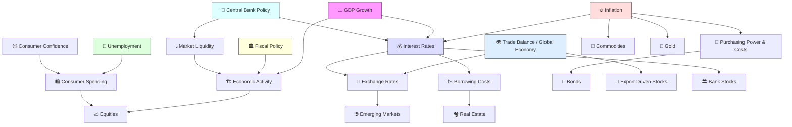

```mermaid
graph TD

%% Core Indicators
GDP["📊 GDP Growth"]
Inflation["🔥 Inflation"]
Interest["💰 Interest Rates"]
Unemployment["👷 Unemployment"]
Fiscal["🏛️ Fiscal Policy"]
Trade["🌍 Trade Balance / Global Economy"]
Confidence["😊 Consumer Confidence"]
CentralBanks["🏦 Central Bank Policy"]

%% Economic Outcomes
GDP --> Economy["🏗️ Economic Activity"]
Inflation --> Prices["💸 Purchasing Power & Costs"]
Interest --> Borrowing["📉 Borrowing Costs"]
Unemployment --> Spending["🛍️ Consumer Spending"]
Confidence --> Spending
Fiscal --> Economy
Trade --> Currency["💱 Exchange Rates"]
Interest --> Currency
Inflation --> Interest
GDP --> Interest
CentralBanks --> Interest
CentralBanks --> Liquidity["💧 Market Liquidity"]
Liquidity --> Economy

%% Asset Classes
Economy --> Equities["📈 Equities"]
Spending --> Equities
Prices --> Bonds["🏦 Bonds"]
Borrowing --> RealEstate["🏘️ Real Estate"]
Inflation --> Commodities["🌾 Commodities"]
Inflation --> Gold["🥇 Gold"]
Currency --> EM["🌐 Emerging Markets"]
Trade --> Exporters["🚢 Export-Driven Stocks"]
Interest --> Banks["🏛️ Bank Stocks"]

%% Notes
style GDP fill:#F9F,stroke:#333,stroke-width:1px
style Inflation fill:#FDD,stroke:#333,stroke-width:1px
style Interest fill:#DDF,stroke:#333,stroke-width:1px
style Unemployment fill:#DFD,stroke:#333,stroke-width:1px
style Fiscal fill:#FFD,stroke:#333,stroke-width:1px
style Trade fill:#DEF,stroke:#333,stroke-width:1px
style CentralBanks fill:#DFF,stroke:#333,stroke-width:1px
```
