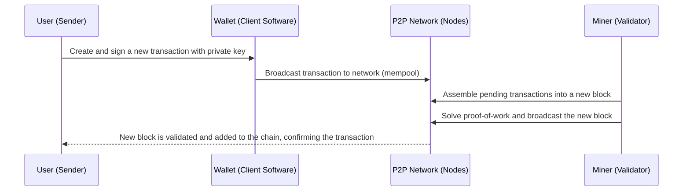

# A Comprehensive Guide to Blockchain and Cryptocurrency

## Introduction

Blockchain technology and cryptocurrencies have transformed finance over
the past decade, creating a new digital asset class and decentralized
financial ecosystem. This guide provides a broad overview of how
blockchain works and dives deep into the key architectures underpinning
cryptocurrencies. It also surveys the cryptocurrency trading landscape
at a high level, with a focus on prominent aspects like exchanges
(especially Coinbase) and related technologies. The content is
structured in two main parts: **(1)** Blockchain technology fundamentals
and ecosystem, and **(2)** Cryptocurrency markets and trading. We use
clear explanations, diagrams, and examples to bridge the gap for a
software engineer with a finance background looking to enter the crypto
domain.

## Part 1: Blockchain Technology and Ecosystem

### Blockchain Fundamentals -- The Big Picture

At its core, a **blockchain** is a type of distributed ledger that
records transactions in a chain of *blocks* secured by cryptography.
Each block contains some data (e.g. a batch of transactions), a
timestamp, and a *cryptographic hash* linking it to the previous
block[\[1\]](https://en.wikipedia.org/wiki/Blockchain#:~:text=The%20blockchain%20is%20a%20distributed,subsequent%20blocks%20and%20obtaining%20network).
Because each block references the hash of the block before it, the
blocks form an append-only chain (much like a linked list) that is
**tamper-resistant** -- altering the contents of a past block would
invalidate all subsequent blocks unless the change is agreed upon by the
network[\[2\]](https://en.wikipedia.org/wiki/Blockchain#:~:text=tree%20%2C%20where%20data%20nodes,consensus%20to%20accept%20these%20changes).
In other words, once a transaction is confirmed and added to the
blockchain, it's extremely difficult to change it retroactively without
majority network approval. This property solves the longstanding
**double-spending problem** in digital money by ensuring the ledger's
history cannot be falsified or spent
twice[\[3\]](https://en.wikipedia.org/wiki/Blockchain#:~:text=A%20blockchain%20was%20created%20by,The).

A blockchain network is typically **decentralized** and **peer-to-peer
(P2P)**. There is no central server; instead, many independent computers
(nodes) maintain copies of the ledger and coordinate to validate new
blocks via a **consensus
algorithm**[\[4\]](https://en.wikipedia.org/wiki/Blockchain#:~:text=Blockchains%20are%20typically%20managed%20by,5).
All nodes follow a protocol (rules) to agree on which new transactions
and blocks are valid, achieving consensus despite potentially malicious
or faulty actors. This makes blockchains highly resilient (they have
strong Byzantine fault tolerance) and *secure by
design*[\[4\]](https://en.wikipedia.org/wiki/Blockchain#:~:text=Blockchains%20are%20typically%20managed%20by,5).
The first successful blockchain was introduced with Bitcoin in 2008 by
the pseudonymous Satoshi
Nakamoto[\[3\]](https://en.wikipedia.org/wiki/Blockchain#:~:text=A%20blockchain%20was%20created%20by,The).
Bitcoin's blockchain proved that it's possible to have a **trustless**
digital currency -- one that requires no central authority -- by
combining cryptography, game-theoretic incentives, and distributed
consensus to maintain a reliable ledger of transactions.

To illustrate, consider how a Bitcoin transaction gets added to the
blockchain:

In the above sequence, once the miner finds a valid block (in Bitcoin's
case, by **Proof-of-Work** solving a cryptographic puzzle), that block
is propagated to all nodes. Each node updates their copy of the
blockchain, and the transaction is considered confirmed. This
decentralized process happens continually, so the ledger grows block by
block.

### Block Structure and Security

Each block in a blockchain typically contains: (a) a list of verified
transactions, (b) the hash of the previous block, and (c) metadata like
timestamp and a **Merkle root** (a hash representing all transactions in
the block). By linking hashes, blocks form an immutable chain -- if an
adversary tried to modify a transaction in an old block, that block's
hash would change, breaking the link to the next block. The network
would reject this invalid chain unless the attacker could also redo *all
subsequent blocks' work* and convince \>50% of nodes to accept it, which
is computationally infeasible in large
networks[\[2\]](https://en.wikipedia.org/wiki/Blockchain#:~:text=tree%20%2C%20where%20data%20nodes,consensus%20to%20accept%20these%20changes)[\[4\]](https://en.wikipedia.org/wiki/Blockchain#:~:text=Blockchains%20are%20typically%20managed%20by,5).
This makes the ledger **append-only** and highly secure against
tampering without widespread consensus. In essence, the blockchain's
design ensures that **no single party** can unilaterally alter the
history; instead, network consensus dictates the valid chain.

We can visualize a simple blockchain with a chain of blocks:

    flowchart LR
        G[Genesis Block] --> B1[Block 1] --> B2[Block 2] --> B3[Block 3] --> B4[Block 4]
        %% Each block points to the previous block's hash (forming a chain)

In the diagram above, each block (after the first **genesis block**)
contains a reference (pointer) to the hash of the block before it. This
creates a single main chain. Competing blocks occasionally appear (e.g.
two miners find a block at nearly the same time), resulting in a
temporary fork. The network resolves this by eventually choosing one
chain (usually the longest/heaviest work chain) as the valid **main
chain** and the other branch's block becomes an **orphan (stale) block**
that is discarded.

**Decentralization:** Public blockchains like Bitcoin and Ethereum are
*permissionless* -- anyone can run a node, participate in validation
(mining/staking), and view the ledger. This openness, combined with
cryptographic verification, means participants don't need to trust each
other or a central entity; the system's rules and broad participation
secure the network. (There are also private/permissioned blockchains for
enterprise use, but these sacrifice decentralization and are outside our
main scope.) Blockchains enable *trust-minimized* transactions: two
parties can transact value or data without needing a bank or
intermediary, relying instead on the network protocol to enforce
honesty[\[3\]](https://en.wikipedia.org/wiki/Blockchain#:~:text=A%20blockchain%20was%20created%20by,The).

### Consensus Mechanisms: Proof-of-Work vs Proof-of-Stake

**Consensus algorithms** are the heart of blockchain's operation,
determining how all nodes agree on new blocks. The two most prominent
mechanisms are **Proof-of-Work (PoW)** and **Proof-of-Stake (PoS)**:

-   **Proof-of-Work (PoW):** Used by Bitcoin and others, PoW requires
    *miners* to perform computationally intensive hashing to "prove"
    they expended effort (work) to find a valid block. In Bitcoin,
    miners compete to solve a cryptographic puzzle (finding a hash below
    a target); the first to solve it adds the next block and earns a
    reward. PoW makes attacking the network expensive because rewriting
    history would require redoing the cumulative work of all blocks
    (massive computational cost). However, PoW is energy-intensive. For
    example, before 2022 Ethereum also used PoW and consumed large
    amounts of electricity. PoW blockchains have probabilistic finality
    -- a transaction is more secure as more blocks are piled on top
    (e.g. 6 confirmations in Bitcoin). Block time and throughput in PoW
    systems are limited (Bitcoin \~10 minutes per block, \~7
    transactions per second).

-   **Proof-of-Stake (PoS):** In PoS, instead of expending energy,
    *validators* lock up some stake (coins) as collateral to secure the
    network. A validator is pseudo-randomly chosen (weighted by stake or
    other factors) to propose the next block, and others attest to its
    validity. If a validator behaves maliciously (e.g. approves invalid
    blocks), they can be penalized (slashed) by losing their staked
    coins. PoS thus relies on economic incentives rather than raw work.
    It is far more energy-efficient -- when Ethereum transitioned from
    PoW to PoS in "The Merge" (Sept 2022), the Ethereum blockchain's
    energy usage dropped by **over
    99.9%**[\[5\]](https://en.wikipedia.org/wiki/Ethereum#:~:text=The%20switch%20from%20proof,be%20used%20to%20mine%20other).
    PoS can also offer faster finality (Ethereum's PoS finalizes blocks
    in a few epochs, \~6--12 minutes, meaning transactions are
    irreversible after that). Many newer blockchains (Cardano, Solana,
    Polkadot, etc.) use variations of PoS or other alternatives
    (Proof-of-Authority, Delegated PoS, etc.) to achieve greater
    scalability.

**Ethereum** is a key case study here: It launched with PoW like
Bitcoin, but with the added feature of *smart contracts* (more on this
soon). In 2022, Ethereum switched to PoS, massively improving its energy
efficiency[\[5\]](https://en.wikipedia.org/wiki/Ethereum#:~:text=The%20switch%20from%20proof,be%20used%20to%20mine%20other).
Ethereum's approach to scaling includes PoS plus sharding and "Layer 2"
solutions (we'll discuss these) to increase transaction throughput. By
contrast, Bitcoin has remained on PoW and scales via second-layer
networks (e.g. the Lightning Network).

### Smart Contracts and Programmability

One of the major evolutions in blockchain tech was moving from Bitcoin's
relatively simple transaction scripting to more **programmable**
blockchains like Ethereum. Bitcoin's scripting language (called
**Script**) is deliberately limited in functionality -- it's *not
Turing-complete*, meaning you cannot build arbitrary loops or complex
logic (this was a design choice to prioritize security and simplicity).
Bitcoin Script can support basic smart contracts (like multi-signature
wallets or time-lock releases), but it cannot natively support the rich
decentralized applications we see in the **DeFi** and NFT
world[\[6\]](https://tangem.com/en/blog/post/bitcoin-smart-contracts/#:~:text=The%20Bitcoin%20blockchain%20can%20support,more%20secure%20but%20less%20adaptable).

**Ethereum**, introduced in 2015, expanded blockchain's capabilities by
incorporating a built-in **Turing-complete** programming language via
the Ethereum Virtual Machine (EVM). Ethereum smart contracts are
programs (written often in Solidity or Vyper) that run on the
blockchain. They can encode arbitrary logic for financial instruments,
games, digital organizations, and more. This flexibility comes at the
cost of complexity -- Ethereum must manage resource usage (via gas fees)
to prevent infinite loops or abuse of its
Turing-completeness[\[6\]](https://tangem.com/en/blog/post/bitcoin-smart-contracts/#:~:text=The%20Bitcoin%20blockchain%20can%20support,more%20secure%20but%20less%20adaptable).
Nonetheless, this was a watershed innovation: blockchains could now
serve as general-purpose **decentralized application platforms** in
addition to handling cryptocurrency transfers.

-   *Example:* On Ethereum, one can deploy a smart contract for an
    **ERC-20 token** (a custom cryptocurrency running on Ethereum), or a
    **decentralized exchange** like Uniswap that is just a collection of
    smart contracts automating trades. These contracts execute exactly
    as coded, without requiring a middleman -- *"code is law"* in this
    context. This enabled the explosion of **decentralized finance
    (DeFi)** protocols (lending, trading, derivatives, etc. on
    blockchain) and other novel applications like NFTs (non-fungible
    tokens for digital art/collectibles).

In summary, Bitcoin pioneered the blockchain as a ledger for digital
money, and Ethereum extended it to a platform for decentralized
computation. Other blockchains have since emerged with variations -- for
instance, **Solana** offers high throughput and low latency (using a PoS
variant with a unique timing mechanism), **Cardano** focuses on formal
verification and a PoS protocol called Ouroboros, **Polkadot** enables
interoperable multi-chain networks, and so on. Each has different
trade-offs, but the fundamental principles of blockchain (distributed
ledgers, consensus, cryptographic security) remain the common
foundation.

### Major Blockchain Platforms and Market Share

The cryptocurrency ecosystem today includes thousands of blockchain
networks and tokens, but a few dominant platforms account for the
majority of usage and market value:

-   **Bitcoin (BTC):** The original cryptocurrency and largest by market
    capitalization. Bitcoin is viewed as "digital gold" and a store of
    value. As of 2025, there are over 18,000 cryptocurrencies, yet
    Bitcoin has led the market since its creation and still commands the
    largest share -- roughly **57%** of the entire crypto market's
    value[\[7\]](https://www.demandsage.com/cryptocurrency-market-size/#:~:text=,1%20billion%20in%202025)[\[8\]](https://www.demandsage.com/cryptocurrency-market-size/#:~:text=9,358%20trillion%20market%20cap).
    With a market cap in the trillions (\>\$2.3 trillion in
    mid-2025)[\[8\]](https://www.demandsage.com/cryptocurrency-market-size/#:~:text=9,358%20trillion%20market%20cap),
    Bitcoin's network is the most battle-tested. It remains a PoW chain,
    primarily used for relatively simple transactions (sending BTC) and
    as a reserve asset. Bitcoin's throughput is low (\~7 TPS), which has
    led to development of secondary layers to improve speed (see
    Lightning Network below). The Bitcoin community prioritizes security
    and decentralization over adding new features, so Bitcoin's base
    layer functionality has changed little over the years.

-   **Ethereum (ETH):** The second-largest platform (market cap often in
    the several hundreds of
    billions)[\[9\]](https://www.demandsage.com/cryptocurrency-market-size/#:~:text=2%20Ethereum%20%28ETH%29%24517.773%20Billion%2444.547%20Billion%2B0.90,1.08)
    and by far the leader in smart contract capabilities. Ethereum is
    the backbone of DeFi and many other crypto sectors. Thousands of
    tokens (ERC-20 standard) and decentralized apps run on Ethereum. In
    2022, Ethereum moved to PoS consensus (reducing energy use
    \~99%[\[5\]](https://en.wikipedia.org/wiki/Ethereum#:~:text=The%20switch%20from%20proof,be%20used%20to%20mine%20other))
    and is planning to implement shard chains to scale. Current Ethereum
    capacity is around 15--30 TPS on-chain, but with **Layer 2 rollups**
    (bundling transactions off-chain) it can effectively handle much
    more. Ethereum's share of the crypto market is typically second to
    Bitcoin; for example, in 2025 Ethereum's market dominance is around
    13--15% (with a market cap in the \~\$0.5 trillion
    range)[\[9\]](https://www.demandsage.com/cryptocurrency-market-size/#:~:text=2%20Ethereum%20%28ETH%29%24517.773%20Billion%2444.547%20Billion%2B0.90,1.08).
    More importantly, Ethereum dominates in developer activity -- most
    new crypto innovations (DEXs, NFTs, DAO governance, etc.) started on
    Ethereum or EVM-compatible chains.

-   **Altcoins (Other Major Blockchains):** Beyond BTC and ETH, there
    are a few other notable blockchain networks:

-   **Binance Smart Chain (BNB Chain):** A PoS-authority chain launched
    by crypto exchange Binance. BNB Chain offers smart contracts
    compatible with Ethereum's tooling (EVM) but with higher throughput
    and lower fees, at the cost of being more centralized (limited
    validators). BNB (its native token) is among top market cap coins
    (often #3 or #4). Many alternative tokens and DApps run here, though
    it's somewhat dependent on Binance's ecosystem.

-   **Cardano (ADA):** A PoS blockchain with a research-driven approach.
    It introduced smart contracts in 2021 and emphasizes formal methods.
    Its adoption in DeFi is smaller so far compared to Ethereum.

-   **Solana (SOL):** A high-performance blockchain using a unique
    Proof-of-History + PoS consensus, aiming for very high TPS
    (thousands) suitable for trading and gaming applications. Solana
    does not rely on sharding or layer2, instead pushing the limits of
    single-chain throughput with more powerful nodes. It's known for
    fast and cheap transactions, though it sacrifices some
    decentralization (requiring robust hardware for validators).

-   **Ripple (XRP Ledger):** An older network aimed at bank and payment
    use cases, using a federated consensus (not PoW/PoS). XRP is often
    top 5 in market cap, but the platform is more specialized for
    payments.

-   **Others:** Polkadot (multi-chain network), Avalanche (uses multiple
    chains and a fast consensus), **Stablecoin** networks (see below),
    and various layer-2 networks on top of Ethereum.

It's worth noting that by 2025, the **total cryptocurrency market cap**
is in the multi-trillions ( \~\$3.9 trillion as of Aug
2025[\[10\]](https://www.demandsage.com/cryptocurrency-market-size/#:~:text=By%20%20%20Daniel%20Ruby,August%2021%2C%202025)[\[11\]](https://www.demandsage.com/cryptocurrency-market-size/#:~:text=Cryptocurrency%20Market%20Size%3A%20Key%20Statistics)
), and there are *over 18,000 different crypto tokens* in
existence[\[12\]](https://www.demandsage.com/cryptocurrency-market-size/#:~:text=1,82%20billion%20worldwide).
However, Bitcoin and Ethereum together typically comprise the majority
of market value and are the most systemically important. For instance,
Bitcoin was about 57% of total crypto market cap in 2025 and Ethereum
perhaps \~13%, with the rest (30% or so) split among thousands of
"altcoins"[\[7\]](https://www.demandsage.com/cryptocurrency-market-size/#:~:text=,1%20billion%20in%202025)[\[8\]](https://www.demandsage.com/cryptocurrency-market-size/#:~:text=9,358%20trillion%20market%20cap).
The top 10 coins usually include a couple of **stablecoins** as well
(USD-pegged tokens like Tether and USD Coin -- more on these shortly).
This distribution indicates how central the top two chains are in the
crypto landscape.

### Supporting Technologies ("Satellite" Ecosystem)

Around blockchain networks themselves, a variety of supporting
technologies and tools have developed to address limitations and expand
use cases. As a software engineer, understanding these "satellite"
technologies is important for the full picture:

-   **Layer 2 Scaling Solutions:** To improve throughput and reduce
    fees, many networks use secondary layers on top of the main chain.
    For Bitcoin, the primary example is the **Lightning Network**, a
    "payment channel" network that settles transactions off-chain and
    periodically records netted results on-chain. The Lightning Network
    allows users to send Bitcoin almost instantly with negligible fees
    by conducting most transactions off the main Bitcoin blockchain
    (it's akin to an express lane for small
    payments)[\[13\]](https://www.coinbase.com/learn/your-crypto/what-is-lightning#:~:text=The%20Lightning%20Network%20allows%20users,HOV%20lane%20on%20a%20highway)[\[14\]](https://www.coinbase.com/learn/your-crypto/what-is-lightning#:~:text=The%20Lightning%20Network%20was%20invented%2C,transactions%20on%20the%20main%20blockchain).
    Lightning can theoretically handle **millions of transactions per
    second** by keeping most activity off-chain and only using Bitcoin's
    blockchain for opening/closing
    channels[\[14\]](https://www.coinbase.com/learn/your-crypto/what-is-lightning#:~:text=The%20Lightning%20Network%20was%20invented%2C,transactions%20on%20the%20main%20blockchain).
    Similarly, Ethereum leverages layer-2 networks called **rollups**
    (e.g. Optimism, Arbitrum) which batch many transactions off-chain
    and post compressed proofs back to Ethereum. Developers may choose
    to build on a layer2 for speed and cost -- *"for faster and
    lower-cost applications, developers might build on layer2 protocols
    like Optimism or
    Arbitrum"*[\[15\]](https://medium.com/the-coinbase-blog/a-simple-guide-to-the-web3-developer-stack-8364b612d69c#:~:text=For%20faster%20and%20lower,or%20Synapse).
    These solutions significantly increase capacity while inheriting the
    base layer's security.

-   **Node Infrastructure Providers:** Running a blockchain node can be
    non-trivial, especially for developers who just want to interact
    with the blockchain (querying data, broadcasting transactions)
    without managing infrastructure. Services like **Infura**,
    **Alchemy**, and **Coinbase Cloud** offer API access to full nodes
    as a service. For instance, Coinbase Cloud (previously Bison Trails)
    and Infura allow developers to read/write to Ethereum and other
    networks without hosting their own node, simplifying DApp
    development[\[16\]](https://medium.com/the-coinbase-blog/a-simple-guide-to-the-web3-developer-stack-8364b612d69c#:~:text=infrastructure%20primitives%20come%20into%20play).
    This is important in practice -- many web3 apps rely on such
    providers under the hood to connect to blockchain data.

-   **Wallets and Key Management:** A **wallet** in crypto is software
    (or hardware device) that stores your private keys and helps you
    sign transactions. Managing cryptographic keys securely is
    paramount, as possession of the private key equals control of the
    funds. There are custodial wallets (where a company like an exchange
    holds your keys) and non-custodial wallets (you hold your own keys).
    Tools like **MetaMask** (popular Ethereum browser wallet) or
    **Coinbase Wallet** (Coinbase's self-custody mobile wallet) allow
    users to interface with blockchains
    directly[\[17\]](https://medium.com/the-coinbase-blog/a-simple-guide-to-the-web3-developer-stack-8364b612d69c#:~:text=Wallet%20%26%20Key%20Management%20%E2%80%94,facing%20applications).
    For enterprises, there are also key management solutions and
    hardware security modules to protect large holdings. As a developer,
    integrating wallets (for user authentication via signature, etc.) is
    a common task in web3 apps.

-   **Stablecoins:** These are cryptocurrencies pegged to stable assets
    (most often 1 USD). They have become vital in the trading ecosystem
    as a stable "cash" equivalent to park value and quote trades. The
    largest stablecoins are **Tether (USDT)** and **USD Coin (USDC)**.
    USDT, issued by Tether Ltd., has the highest trading volume of any
    cryptocurrency and a market cap around \$83 billion as of
    2023[\[18\]](https://cointelegraph.com/news/coinbase-takes-equity-stake-circle-usdc-centre-consortium-shuts-down#:~:text=Circle%20and%20Coinbase%20launched%20USDC,7)
    (and growing -- one source projects \$164B by
    2025[\[9\]](https://www.demandsage.com/cryptocurrency-market-size/#:~:text=2%20Ethereum%20%28ETH%29%24517.773%20Billion%2444.547%20Billion%2B0.90,1.08)).
    **USDC**, launched by Circle and Coinbase's joint Centre consortium
    in 2018, is the second-largest with \~\$26 billion market
    cap[\[18\]](https://cointelegraph.com/news/coinbase-takes-equity-stake-circle-usdc-centre-consortium-shuts-down#:~:text=Circle%20and%20Coinbase%20launched%20USDC,7).
    Stablecoins operate on blockchains (e.g. USDT on multiple chains
    like Ethereum, Tron, etc., USDC on Ethereum and others) and are
    typically backed by reserves. They are crucial for crypto trading --
    many exchanges use stablecoins as quote currencies (e.g. BTC/USDT
    trading pair), and they enable easier movement of liquidity without
    going back to fiat. (Stablecoins also enable use cases like
    remittances and DeFi lending, but their primary role is as stable
    liquidity.) **Note:** Stablecoins introduce some centralization
    (they are usually managed by companies), and have regulatory
    scrutiny, but from a domain knowledge perspective, any Coinbase
    engineer should be familiar with how stablecoin transactions and
    integrations work.

-   **Oracles:** Blockchains by themselves can only verify data
    *internal* to the chain. **Oracles** are services or protocols that
    provide verified external data to smart contracts. For example, a
    decentralized oracle network like **Chainlink** can feed price feeds
    (exchange rates), weather data, event outcomes, etc., onto the
    blockchain so that smart contracts can react to real-world events.
    Oracles bridge on-chain and off-chain
    data[\[19\]](https://medium.com/the-coinbase-blog/a-simple-guide-to-the-web3-developer-stack-8364b612d69c#:~:text=Oracles%20%E2%80%94%20For%20a%20typical,chain%20data%20sources).
    In trading contexts, oracles are often used for price data in DeFi
    platforms (so knowing how they work is useful if you might work on
    any price-related features or risk management).

-   **Interoperability and Bridges:** With many independent blockchains,
    there's a need to transfer value and data between them.
    **Cross-chain bridges** are protocols that allow tokens to move from
    one chain to another (often by locking on Chain A and minting a
    representation on Chain B). Projects like **Polygon**, **Cosmos (IBC
    protocol)**, **Polkadot**, and others focus on enabling chains to
    interoperate. For instance, **Wrapped Bitcoin (WBTC)** is Bitcoin
    "bridged" onto Ethereum as an ERC-20 token so it can be used in
    Ethereum's DeFi apps. An engineer in crypto should grasp the basics
    of how bridging works (and the security risks, as many bridge hacks
    have occurred).

-   **Others:** The ecosystem is broad -- there are decentralized file
    storage networks (e.g. IPFS, Arweave) to store data off-chain but
    with integrity
    guarantees[\[20\]](https://medium.com/the-coinbase-blog/a-simple-guide-to-the-web3-developer-stack-8364b612d69c#:~:text=Decentralized%20storage%20%E2%80%94%20Storing%20every,actual%20blog%20content%20on%20Arweave),
    decentralized compute protocols (Akash, etc.) for off-chain
    computation, identity projects (ENS -- Ethereum Name Service for
    human-readable
    addresses[\[21\]](https://medium.com/the-coinbase-blog/a-simple-guide-to-the-web3-developer-stack-8364b612d69c#:~:text=Identity%20%E2%80%94%20protocols%20like%20ENS,Additionally%2C%20companies)),
    and more. While not all are directly relevant to exchange or trading
    work, they compose the "Web3 stack" that a well-rounded crypto
    engineer would be aware of. Many roles at companies like Coinbase
    (especially Coinbase Cloud or Coinbase Wallet teams) may involve
    interacting with these technologies to support new features.

In summary, the blockchain and crypto ecosystem extends beyond just
coins and chains. It includes a network of layers and services that
enhance scalability (Layer 2 networks), usability (wallets, identity),
connectivity (bridges, oracles), and stability (stablecoins). A
successful crypto engineer will have a solid grasp of how these pieces
fit together to serve different user needs.

## Part 2: Cryptocurrency Trading Landscape

With a foundation in the technology, we now turn to the **cryptocurrency
trading landscape**. This encompasses the exchanges, markets, and
mechanisms by which crypto assets are bought, sold, and traded. As
someone eyeing roles at Coinbase or similar, it's crucial to understand
both how trading platforms operate and the broader market structure.

### Centralized vs Decentralized Exchanges

A **cryptocurrency exchange** is a marketplace where users can trade
cryptocurrencies -- either swapping one crypto for another, or
exchanging crypto and fiat currency (e.g. USD) when on-ramps are
supported. Exchanges come in two major forms:

-   **Centralized Exchanges (CEX):** These are businesses that operate
    trading platforms similar in concept to traditional stock exchanges
    or brokerage, but for crypto. Users open accounts with the exchange,
    deposit funds (crypto or fiat), and the exchange holds those funds
    in custody while also matching buy/sell orders on an internal
    system. Coinbase, Binance, Kraken, and Gemini are examples of
    centralized exchanges. CEXs are typically **regulated** (if
    operating in jurisdictions like the U.S. or Europe) and comply with
    KYC/AML (Know-Your-Customer / Anti-Money-Laundering) requirements.
    They act as trusted intermediaries -- users must trust the
    exchange's security and solvency. The upside is convenience: a good
    CEX provides a user-friendly experience, customer support, fast
    trades, and often insurance or guarantees against certain losses.
    Many centralized exchanges **carry insurance**, use secure
    custodians or bank-like storage for client funds, and undergo
    regular
    audits[\[22\]](https://www.investopedia.com/tech/190-cryptocurrency-exchanges-so-how-choose/#:~:text=itself)[\[23\]](https://www.investopedia.com/tech/190-cryptocurrency-exchanges-so-how-choose/#:~:text=Fourth%2C%20many%20centralized%20exchanges%20carry,should%20use%20a%20centralized%20exchange).
    For most retail traders, a reputable CEX is the safest and easiest
    way to get started in crypto
    trading[\[24\]](https://www.investopedia.com/tech/190-cryptocurrency-exchanges-so-how-choose/#:~:text=However%2C%20there%20are%20many%20reasons,address%20for%20the%20exchange%20itself)[\[23\]](https://www.investopedia.com/tech/190-cryptocurrency-exchanges-so-how-choose/#:~:text=Fourth%2C%20many%20centralized%20exchanges%20carry,should%20use%20a%20centralized%20exchange).
    (Indeed, Coinbase markets itself as *"the easiest and most trusted
    place to buy, sell, and manage your
    crypto"*[\[25\]](https://aws.amazon.com/blogs/startups/how-coinbase-builds-its-blockchain-infrastructure/#:~:text=best,is%20a%20phrase%20that%20gets).)
    The trade-off is less anonymity and users not holding their own
    private keys (the exchange controls the funds on users' behalf).
    It's worth noting that because the exchange holds user funds,
    **security** is paramount -- hacks of exchanges (e.g. Mt. Gox in
    2014, or more recently KuCoin in 2020) have led to user fund losses.
    Top exchanges mitigate this via cold storage of funds, bug bounties,
    and robust operational security.

-   **Decentralized Exchanges (DEX):** These are protocols (usually a
    set of smart contracts on a blockchain like Ethereum) that allow
    users to trade directly from their own wallets, without any central
    custodian. Notable DEXs include **Uniswap**, **SushiSwap** (both
    Automated Market Maker type exchanges on Ethereum and other chains),
    **Curve**, and order-book-style DEXs like **dYdX** or **Serum
    (Solana)**. In a DEX, trades are executed via blockchain
    transactions -- for example, on Uniswap you send tokens to a smart
    contract and receive others in return according to an algorithmic
    price formula. DEXs thus enable **peer-to-peer trading** with *no
    centralized intermediary*: the only "middleman" is the code of the
    smart
    contract[\[26\]](https://www.investopedia.com/tech/190-cryptocurrency-exchanges-so-how-choose/#:~:text=Decentralized%20Exchanges).
    This means you retain custody of your assets until the moment of
    trade (in one transaction you authorize a trade from your wallet).
    DEXs typically do **not require KYC**, offering greater privacy.
    However, there are downsides: you must use a compatible wallet and
    know how to interact with the blockchain; trades can be slower or
    more expensive when network fees are high; and without centralized
    oversight, scams or impermanent loss (for liquidity providers in
    AMMs) are risks users must navigate. There's also no customer
    support to call if you make a mistake -- it's a very
    "self-sovereign" experience. DEX volumes have grown immensely since
    2020, but CEXs still handle the majority of retail volume due to
    ease of use. It's likely a Coinbase engineer would mostly focus on
    CEX operations, but Coinbase and others also interact with DEXs (for
    instance, Coinbase Wallet lets users swap on DEXs, and Coinbase has
    listed DeFi tokens that derive their value from these ecosystems).

**Hybrid approaches:** Some newer platforms blur lines, such as
*non-custodial* centralized exchanges or *DEX aggregators*. But
fundamentally, understanding the difference between a company-run
exchange vs. a protocol is key. Regulatory-wise, centralized exchanges
are under increasing scrutiny (they must register in many countries,
follow financial regulations), whereas decentralized ones operate in a
gray area since there's often no single legal entity in control.

### Major Exchanges and Key Players

The crypto exchange landscape is diverse, with hundreds of exchanges
globally[\[27\]](https://www.demandsage.com/cryptocurrency-market-size/#:~:text=ranging%20from%20%24192%20billion%20to,98%20trillion).
However, a few major players dominate in terms of user base and volume:

-   **Coinbase:** A U.S.-based exchange founded in 2012, often
    considered one of the most secure and compliant platforms. Coinbase
    became the first crypto exchange to go public as a company (Nasdaq:
    COIN) in 2021. It is known for its user-friendly interface and for
    onboarding millions of users into crypto. Coinbase offers a
    brokerage for beginners (simple buy/sell), an advanced trading
    interface (formerly Coinbase Pro, now integrated), custodial
    services for institutions, staking for certain assets, and more. It
    supports **200+ cryptocurrencies** for trading and over **300
    trading pairs** as of recent
    counts[\[28\]](https://www.investopedia.com/tech/190-cryptocurrency-exchanges-so-how-choose/#:~:text=Another%20important%20consideration%20is%20the,300%20available%20in%20tradeable%20pairs).
    Coinbase's reputation for trust is strong -- it's *"the easiest and
    most trusted"* portal according to its own marketing and industry
    perception[\[25\]](https://aws.amazon.com/blogs/startups/how-coinbase-builds-its-blockchain-infrastructure/#:~:text=best,is%20a%20phrase%20that%20gets).
    Being U.S.-regulated (it's registered as a Money Services Business
    with FinCEN and licensed in many states), Coinbase emphasizes
    compliance and security. In fact, **security** is a selling point:
    Coinbase keeps the vast majority of customer funds in offline cold
    storage, and historically (as of a 2016 report) it was said to store
    about 10% of all bitcoins in circulation in its
    custody[\[29\]](https://www.coinbase.com/blog/how-coinbase-builds-secure-infrastructure-to-store-bitcoin-in-the-cloud#:~:text=and%20productive%20infrastructure%20in%20the,cloud)
    -- an enormous responsibility. Working at Coinbase means dealing
    with systems at massive scale and strict security requirements.

-   **Binance:** The world's largest exchange by trading volume (though
    not available in some jurisdictions like the U.S. under its global
    site). Binance offers hundreds of altcoins and very low fees,
    attracting a huge global user base. It also has an American partner,
    Binance.US, for compliance with U.S. regulations, but the global
    Binance is much bigger. Binance's ecosystem is wide (it even has its
    own blockchain, as mentioned, BNB Chain). A Coinbase engineer should
    at least be aware of Binance's existence and its competitive stance
    -- Binance often lists new assets faster and offers features like
    derivatives trading, which Coinbase has been slower to expand into.
    However, Binance has faced regulatory challenges in multiple
    countries.

-   **Kraken:** Another U.S.-based exchange, known for security and
    operating since 2011. Kraken offers a range of cryptos and has a
    strong reputation among early crypto users. It also provides futures
    trading for certain cryptos.

-   **Gemini:** U.S. exchange founded by the Winklevoss twins,
    emphasizes a "regulation-first" approach similar to Coinbase. It's
    smaller in market share but known for security and compliance as
    well.

-   **Others:** **FTX** was a major exchange until its high-profile
    collapse in late 2022 (which underscored the importance of
    transparency and regulation -- FTX's failure hurt trust in
    centralized platforms not providing proof of reserves). Other active
    exchanges include **KuCoin**, **Bitfinex**, **Crypto.com Exchange**,
    **OKX**, **Bybit**, and regional players (e.g. **Upbit** in Korea).
    There are also specialized platforms for derivatives (like
    **Deribit** for options). In total, more than 250 exchanges are well
    documented, and before choosing one, users look at reputation,
    security history, fees, and asset
    selection[\[30\]](https://www.investopedia.com/tech/190-cryptocurrency-exchanges-so-how-choose/#:~:text=In%20your%20search%2C%20dig%20deep%3B,an%20exchange%27s%20ethics%20and%20practices).

For a quick sense of scale: as of 2025, around *1,351 exchanges* are
tracked across the crypto
market[\[27\]](https://www.demandsage.com/cryptocurrency-market-size/#:~:text=ranging%20from%20%24192%20billion%20to,98%20trillion),
but a handful of top exchanges handle the majority of volume. Coinbase
is among the top by user count and is often ranked highly for trust and
security, whereas Binance often leads in sheer trading volume. Both are
generally considered "blue chip" exchanges in terms of reliability (in
contrast to smaller or offshore exchanges which might carry more
risk)[\[31\]](https://www.investopedia.com/tech/190-cryptocurrency-exchanges-so-how-choose/#:~:text=Another%20important%20consideration%20is%20the,300%20available%20in%20tradeable%20pairs).

### How an Exchange Like Coinbase Works (Architecture Deep Dive)

Focusing on Coinbase as a case study for a centralized exchange, let's
explore how it bridges the blockchain world with traditional-style
trading infrastructure.

**Custody and Wallet Infrastructure:** When a Coinbase user holds
cryptocurrency on the platform, those coins are managed by Coinbase's
custodial wallet system. Coinbase runs a sophisticated backend that
includes **hot wallets** (online, for processing withdrawals quickly)
and **cold storage** (offline, for the bulk of funds). Private keys are
stored with heavy encryption, split among multiple secure locations, and
with multiple approvers required (this is often called **multisig** or
sharding of keys) -- similar in spirit to the "no single point of
failure"
principle[\[32\]](https://www.coinbase.com/blog/how-coinbase-builds-secure-infrastructure-to-store-bitcoin-in-the-cloud#:~:text=Layered%20Security%20%26%20No%20Single,Point%20Of%20Failure).
Coinbase's engineering blog has discussed "paranoid" infrastructure
measures, like **layered security**, redundant approvals, and limited
access to production
systems[\[32\]](https://www.coinbase.com/blog/how-coinbase-builds-secure-infrastructure-to-store-bitcoin-in-the-cloud#:~:text=Layered%20Security%20%26%20No%20Single,Point%20Of%20Failure).
From an architecture perspective, Coinbase built its system on cloud
infrastructure (AWS) with an eye toward banking-level security and high
availability. In fact, *two* of Coinbase's key architecture tenets are
**immutability** and **ephemerality**: any configuration change to
systems requires a fresh deploy (all infra is codified, no manual
snowflake
servers)[\[33\]](https://aws.amazon.com/blogs/startups/how-coinbase-builds-its-blockchain-infrastructure/#:~:text=In%20specific%20terms%2C%20what%20does,rebuild%20the%20application%2C%E2%80%9D%20says%20Kearny),
and servers are rotated frequently (instances live at most 30 days) to
ensure any potential compromise is
short-lived[\[34\]](https://aws.amazon.com/blogs/startups/how-coinbase-builds-its-blockchain-infrastructure/#:~:text=The%20second%20tenet%20of%20the,itself%20keeps%20Coinbase%20more%20secure).
These practices, along with requiring multiple people's sign-off for
sensitive actions (consensus-based
ops)[\[35\]](https://aws.amazon.com/blogs/startups/how-coinbase-builds-its-blockchain-infrastructure/#:~:text=The%20next%20tenet%20is%20consensus%E2%80%94the,%E2%80%9D)
and heavy automation in
deployments[\[36\]](https://aws.amazon.com/blogs/startups/how-coinbase-builds-its-blockchain-infrastructure/#:~:text=Lastly%2C%20they%20run%20Coinbase%20according,democratizing%20and%20streamlining%20processes%20at),
illustrate how seriously Coinbase approaches secure ops.

**Blockchain Integration:** Unlike a single-blockchain project, an
exchange like Coinbase must interact with **dozens of different
blockchains** to support various cryptocurrencies. Coinbase runs its own
**full nodes** for each supported blockchain (Bitcoin, Ethereum,
Litecoin, etc.). These nodes are the "eyes and ears" into each
network[\[37\]](https://aws.amazon.com/blogs/startups/how-coinbase-builds-its-blockchain-infrastructure/#:~:text=Using%20these%20architectural%20tenets%2C%20how,broadcast%20it%20through%20one%20of).
For example, when you deposit Bitcoin into Coinbase, you send it to a
Bitcoin address that Coinbase provides. Coinbase's Bitcoin nodes detect
that incoming transaction by watching new blocks on the Bitcoin network
and seeing that one of their addresses received
funds[\[38\]](https://aws.amazon.com/blogs/startups/how-coinbase-builds-its-blockchain-infrastructure/#:~:text=blockchain%20network%20as%20their%20eyes,%E2%80%9D).
After the required number of confirmations, Coinbase credits the user's
account with that BTC. On the flip side, when a user withdraws crypto,
Coinbase's system creates a new transaction, signs it with the
exchange's private key, and broadcasts it through their node to the
blockchain[\[39\]](https://aws.amazon.com/blogs/startups/how-coinbase-builds-its-blockchain-infrastructure/#:~:text=through%20a%20wallet%20they%20control%2C,%E2%80%9D).
This way, Coinbase serves as a bridge: translating on-chain transactions
into updates in its internal ledger of user balances, and vice versa.

Because reliability is crucial (users expect to deposit/withdraw at
will), Coinbase maintains **robust node infrastructure**. They often
have multiple nodes for a blockchain for redundancy and load-balancing.
Coinbase engineers have aimed to make this **"blockchain agnostic"** --
i.e. a standardized process to deploy and manage nodes for any new chain
with minimal custom
work[\[40\]](https://aws.amazon.com/blogs/startups/how-coinbase-builds-its-blockchain-infrastructure/#:~:text=That%20also%20means%20their%20infrastructure,%E2%80%9D).
One challenge is that running a full node for some networks can be
resource-intensive (Ethereum, for example, with a large state and high
throughput). Coinbase's team developed an internal tool called
**Snapchain** to handle blockchain node deployments: it essentially
takes a fully-synced node, snapshots its data, and uses that snapshot to
spin up fresh nodes
quickly[\[41\]](https://aws.amazon.com/blogs/startups/how-coinbase-builds-its-blockchain-infrastructure/#:~:text=to%20be%20able%20to%20frequently,%E2%80%9D)[\[42\]](https://aws.amazon.com/blogs/startups/how-coinbase-builds-its-blockchain-infrastructure/#:~:text=To%20minimize%20the%20time%20to,the%20snapshot%20configurations%2C%E2%80%9D%20says%20Kearny).
This addresses the problem of having to re-sync from scratch (which
could take days for a big blockchain) every time they cycle a server.
With Snapchain, they can do blue-green deployments of nodes -- bringing
up a new node with the latest snapshot, switching traffic to it, then
retiring the old node -- all without
downtime[\[41\]](https://aws.amazon.com/blogs/startups/how-coinbase-builds-its-blockchain-infrastructure/#:~:text=to%20be%20able%20to%20frequently,%E2%80%9D).
This system also tags and monitors node sync health, ensuring each
blockchain's node is up-to-date and in consensus with the
network[\[43\]](https://aws.amazon.com/blogs/startups/how-coinbase-builds-its-blockchain-infrastructure/#:~:text=Snapchain%20is%2C%20at%20a%20very,wide)[\[42\]](https://aws.amazon.com/blogs/startups/how-coinbase-builds-its-blockchain-infrastructure/#:~:text=To%20minimize%20the%20time%20to,the%20snapshot%20configurations%2C%E2%80%9D%20says%20Kearny).
The takeaway is that **exchanges invest heavily in infrastructure that
interfaces with blockchains** in a scalable and secure way. Coinbase's
approach (ephemeral, regularly rebuilt nodes) reduces the risk of node
compromise and ensures they can support high volume of
deposit/withdrawal activity
reliably[\[44\]](https://aws.amazon.com/blogs/startups/how-coinbase-builds-its-blockchain-infrastructure/#:~:text=The%20nodes%20are%20critical%20to,%E2%80%9D).

**Trading Engine and Order Books:** Internally, a CEX like Coinbase has
a component known as the **matching engine** -- this is analogous to the
engine of a stock exchange. It's a high-performance system that takes in
orders (buy/sell offers placed by users) and matches them when prices
align. Coinbase likely uses specialized data structures and low-latency
programming (possibly languages like C++ or Rust, and techniques like
memory-locality optimizations) to achieve fast trade execution. In fact,
according to some sources, Coinbase's matching engine can handle on the
order of **hundreds of thousands of orders per
second**[\[45\]](https://www.krayondigital.com/blog/how-order-matching-engines-work-in-crypto-exchanges#:~:text=How%20Order%20Matching%20Engines%20Work,happen%20quickly%20and%20at).
The matching engine maintains the **order book** for each trading pair
(e.g. the list of all open buy orders and sell orders for BTC-USD). When
a new order arrives, if it's a market order or there are existing
opposite orders at the target price, the engine will execute trades and
update balances. All of this happens in Coinbase's internal databases --
not on a blockchain. Trades on a CEX are **off-chain transactions**; the
exchange simply adjusts who owns what in their internal ledger. Only
when users withdraw or deposit do on-chain transactions occur. This
allows exchanges to offer instant trades without waiting for blockchain
confirmations (which would be far too slow for active trading).

From an architecture perspective, Coinbase's trading system is likely
composed of microservices or modules handling various tasks: user
account management, balances and risk checks, the core matching engine
cluster, an API gateway for external clients (Coinbase has both a web UI
and APIs for programmatic trading), and back-office services for
compliance, reporting, etc. Coinbase also has to integrate with
traditional banking for fiat currency deposits/withdrawals (ACH, wire,
credit card buys, etc.), which means they maintain connections to
banking partners and follow strict procedures for KYC/AML.

**High-Level Illustration -- Coinbase Exchange Flow:** To synthesize,
here's a simplified conceptual flow of how Coinbase operates for a user:

    flowchart TB
        user[(User)] -->|Deposit crypto to address| coinbase[(Coinbase Exchange)]
        subgraph coinbase [Coinbase Exchange Platform]
            direction TB
            custody[Custody & Wallet Service] --> trading[Trading Engine & Order Book]
            trading --> custody
        end
        coinbase -->|On-chain monitoring| nodepool[(Blockchain Nodes)]
        nodepool --> coinbase
        user <-->|Places trade (buy/sell)| trading
        user <-->|Withdraw crypto| coinbase
        coinbase -->|Creates tx| nodepool
        nodepool -->|Broadcast to network| blockchain[(Blockchain Network)]

In this diagram: the user deposits crypto, which hits the blockchain and
is detected by Coinbase's **node pool**. Coinbase credits the user's
balance in the internal **custody system**. The user can then create
trade orders which go to the **trading engine** (order book) -- if
matched, Coinbase shifts balances between users accordingly in the
database. When the user wants to withdraw, Coinbase's custody service
prepares an on-chain transaction (via the node) to send the crypto out.
(For fiat flows, Coinbase would interact with banks instead of
blockchains on those ends.)

**Note:** This is a high-level view; the real architecture is far more
complex with many microservices, databases, caching layers,
microsegmentation for security, etc. But it captures the core
interactions: *users vs exchange vs blockchain*.

### Market Dynamics and Prominent Trading Aspects

Cryptocurrency markets operate 24/7 globally -- unlike stock markets,
they don't close on weekends or nights. Prices are highly volatile,
liquidity is spread across many venues, and new assets can emerge (and
sometimes disappear) rapidly. Here are some key aspects of the trading
landscape to understand:

-   **Trading Pairs:** On exchanges, assets are traded in pairs (e.g.
    BTC/USD, ETH/BTC, ETH/USDT). **Stablecoin pairs** are extremely
    popular because they allow traders to move in and out of volatile
    assets into something stable without leaving the crypto ecosystem.
    For example, on many exchanges BTC/USDT is the highest-volume
    market. As noted, Tether (USDT) often has daily trading volume that
    rivals or exceeds Bitcoin itself because it's used as the quote
    currency for so many
    trades[\[9\]](https://www.demandsage.com/cryptocurrency-market-size/#:~:text=2%20Ethereum%20%28ETH%29%24517.773%20Billion%2444.547%20Billion%2B0.90,1.08).
    Coinbase primarily offers fiat pairs (BTC/USD, etc.) for U.S.
    customers, but also supports some crypto--crypto pairs and USD Coin
    (USDC) pairs. Knowing which pairs are most liquid is useful domain
    knowledge.

-   **Order Types and Strategies:** Like traditional markets, crypto
    exchanges offer order types: market orders (execute immediately at
    current prices), limit orders (execute at a set price or better),
    stop orders, etc. A Coinbase engineer might not need to implement
    matching algorithms from scratch (unless working on that team), but
    should understand them. Many HFT (high-frequency trading) firms and
    market makers operate in crypto, seeking to arbitrage price
    differences between exchanges or profit from spread. This means
    exchanges like Coinbase need to handle high API traffic and bursts
    of volume efficiently.

-   **Liquidity and Market Making:** Exchanges often incentivize market
    makers (participants who provide buy/sell orders and thus liquidity)
    via lower fees or even rebates. Liquidity can be fragmented; for
    instance, some altcoins might be very liquid on Binance but not on
    Coinbase. Coinbase tends to list assets more conservatively (due to
    U.S. regulations and its listing criteria) while others might list
    everything. Understanding liquidity distribution helps in context of
    why certain features (like Coinbase's "Advanced Trade" for pro
    users) exist -- to cater to more sophisticated traders.

-   **Regulation and Compliance:** Especially relevant for Coinbase (a
    U.S. company), compliance shapes the trading landscape. Coinbase
    must adhere to laws on sanctions, anti-money-laundering, and
    reporting transactions over certain thresholds. This means robust
    systems for identity verification, transaction monitoring, and even
    blockchain analytics to detect illicit funds. While not "trading"
    per se, these compliance measures are a significant aspect of
    running an exchange. Recent regulatory scrutiny (SEC, etc.) on
    whether certain crypto assets are securities can affect what assets
    Coinbase lists or how products (like interest-bearing accounts) are
    offered. A Coinbase employee should be aware of the basics of these
    issues, as they influence product scope and risk.

-   **Security and Trust:** After several high-profile exchange failures
    (Mt. Gox hack in 2014, QuadrigaCX's collapse in 2019, FTX's collapse
    in 2022), users and regulators have understandably become more
    focused on exchange security and solvency. **Proof of Reserves** is
    an emerging practice where exchanges provide cryptographic proof of
    their on-chain asset reserves to show they indeed hold customer
    deposits 1:1. Coinbase, as a publicly listed company, publishes
    audited financials which adds confidence. But generally, an ethos in
    crypto is "not your keys, not your coins," meaning if you're not
    holding the private keys (as is the case when using a CEX), you have
    to implicitly trust the exchange. This is why *reputation counts* --
    users tend to stick with exchanges that have a long track record of
    security[\[30\]](https://www.investopedia.com/tech/190-cryptocurrency-exchanges-so-how-choose/#:~:text=In%20your%20search%2C%20dig%20deep%3B,an%20exchange%27s%20ethics%20and%20practices).
    As an engineer, maintaining that security (both cyber-security and
    financial integrity) is an ever-present concern.

-   **Beyond Spot Trading -- Derivatives and DeFi:** Crypto trading
    isn't only about spot buying and selling on exchanges like Coinbase.
    There's a huge market for **derivatives** (futures, options, swaps)
    on crypto. Platforms like CME (for Bitcoin futures) or specialized
    crypto derivatives exchanges (e.g. BitMEX, Binance Futures, Bybit)
    allow traders to use leverage. While Coinbase's platform for U.S.
    users historically focused on spot trading, Coinbase did acquire a
    derivatives exchange (FairX, now Coinbase Derivatives) and offers
    some perpetual futures for non-US users. So, knowledge of how a
    **perpetual swap** works (a derivative that behaves like a futures
    contract with no expiry, maintaining a peg via funding rates) could
    be relevant in advanced roles. Similarly, **DeFi trading** (using
    DEXs, liquidity pools, yield farming) is a parallel landscape --
    even if you work on a centralized exchange, it's wise to understand
    DeFi since it represents an innovative frontier that could influence
    centralized offerings. For example, decentralized exchanges
    pioneered Automated Market Makers (AMMs), and now even some
    centralized venues integrate AMM-like products or use DeFi for
    liquidity.

-   **Market Trends:** Crypto markets can be driven by unique trends --
    e.g. a surge of interest in NFTs, or memecoins (like Dogecoin
    rallies), or macro-economic events (inflation fears driving Bitcoin
    interest). They also have cycles of bull and bear markets that are
    more extreme than traditional assets. As part of domain knowledge,
    being aware of these trends helps contextualize the work. For
    instance, during bull runs, exchanges see a spike in volume and new
    user signups (systems must scale rapidly), whereas in bear markets,
    volume might drop and the focus might shift to building new features
    for the next cycle.

### Conclusion and Next Steps

In summary, **blockchain technology** provides the decentralized, secure
infrastructure that makes cryptocurrencies possible, while the **crypto
trading landscape** provides the platforms and mechanisms for people to
actually use and exchange those cryptocurrencies. As a software engineer
from a finance background, you'll find both familiar parallels (order
books, trade execution, risk management) and novel concepts (consensus
algorithms, on-chain programming, decentralized protocols). Coinbase, as
an exemplar, sits at the intersection of these worlds: it runs
traditional-style trading systems interfacing with cutting-edge
blockchain networks. It's a leader in adopting robust infrastructure
practices for security and
scale[\[33\]](https://aws.amazon.com/blogs/startups/how-coinbase-builds-its-blockchain-infrastructure/#:~:text=In%20specific%20terms%2C%20what%20does,rebuild%20the%20application%2C%E2%80%9D%20says%20Kearny)[\[34\]](https://aws.amazon.com/blogs/startups/how-coinbase-builds-its-blockchain-infrastructure/#:~:text=The%20second%20tenet%20of%20the,itself%20keeps%20Coinbase%20more%20secure),
and it remains one of the most prominent **trusted**
exchanges[\[25\]](https://aws.amazon.com/blogs/startups/how-coinbase-builds-its-blockchain-infrastructure/#:~:text=best,is%20a%20phrase%20that%20gets)
in an industry where trust is paramount.

To bridge any remaining gaps in domain knowledge, here are some
suggested focus areas for further learning: - **Read whitepapers:**
Bitcoin's whitepaper (Nakamoto 2008) and Ethereum's yellow paper for
technical depth. - **Explore blockchain data:** Run a Bitcoin or
Ethereum node (or use a blockchain explorer) to see how transactions and
blocks appear in raw form. - **Try DeFi apps:** Use a decentralized
exchange with a small amount of funds to understand wallet interactions
and on-chain trade execution. - **Security basics:** Look into how
private keys, digital signatures, and hashing work in practice (since
these underlie blockchain security). - **Regulatory landscape:** Keep an
eye on crypto regulations (e.g. how the SEC treats crypto assets, or
international frameworks like MiCA in the EU) -- these often shape
product decisions at companies like Coinbase. - **Scaling solutions:**
If interested in the technical scalability, read up on Lightning
Network, Ethereum's rollups (Optimistic vs ZK rollups), sharding, etc.,
to see where blockchain tech is headed in the next few years.

By combining software engineering expertise with this domain-specific
knowledge of blockchain and crypto markets, you'll be well-equipped to
contribute to companies like Coinbase and navigate the rapidly evolving
crypto industry. Good luck on your journey into the world of blockchain
and cryptocurrency!

**Sources:**

-   Blockchain fundamentals and
    design[\[1\]](https://en.wikipedia.org/wiki/Blockchain#:~:text=The%20blockchain%20is%20a%20distributed,subsequent%20blocks%20and%20obtaining%20network)[\[4\]](https://en.wikipedia.org/wiki/Blockchain#:~:text=Blockchains%20are%20typically%20managed%20by,5)[\[3\]](https://en.wikipedia.org/wiki/Blockchain#:~:text=A%20blockchain%20was%20created%20by,The)
-   Bitcoin and Ethereum overview, smart contract
    capabilities[\[6\]](https://tangem.com/en/blog/post/bitcoin-smart-contracts/#:~:text=The%20Bitcoin%20blockchain%20can%20support,more%20secure%20but%20less%20adaptable)[\[5\]](https://en.wikipedia.org/wiki/Ethereum#:~:text=The%20switch%20from%20proof,be%20used%20to%20mine%20other)
-   Cryptocurrency market size and Bitcoin
    dominance[\[7\]](https://www.demandsage.com/cryptocurrency-market-size/#:~:text=,1%20billion%20in%202025)[\[8\]](https://www.demandsage.com/cryptocurrency-market-size/#:~:text=9,358%20trillion%20market%20cap)
-   Lightning Network and layer-2
    scaling[\[13\]](https://www.coinbase.com/learn/your-crypto/what-is-lightning#:~:text=The%20Lightning%20Network%20allows%20users,HOV%20lane%20on%20a%20highway)[\[14\]](https://www.coinbase.com/learn/your-crypto/what-is-lightning#:~:text=The%20Lightning%20Network%20was%20invented%2C,transactions%20on%20the%20main%20blockchain)[\[15\]](https://medium.com/the-coinbase-blog/a-simple-guide-to-the-web3-developer-stack-8364b612d69c#:~:text=For%20faster%20and%20lower,or%20Synapse)
-   Web3 stack (nodes, wallets,
    oracles)[\[16\]](https://medium.com/the-coinbase-blog/a-simple-guide-to-the-web3-developer-stack-8364b612d69c#:~:text=infrastructure%20primitives%20come%20into%20play)[\[19\]](https://medium.com/the-coinbase-blog/a-simple-guide-to-the-web3-developer-stack-8364b612d69c#:~:text=Oracles%20%E2%80%94%20For%20a%20typical,chain%20data%20sources)
-   Coinbase exchange description (trusted reputation,
    operations)[\[25\]](https://aws.amazon.com/blogs/startups/how-coinbase-builds-its-blockchain-infrastructure/#:~:text=best,is%20a%20phrase%20that%20gets)[\[40\]](https://aws.amazon.com/blogs/startups/how-coinbase-builds-its-blockchain-infrastructure/#:~:text=That%20also%20means%20their%20infrastructure,%E2%80%9D)[\[33\]](https://aws.amazon.com/blogs/startups/how-coinbase-builds-its-blockchain-infrastructure/#:~:text=In%20specific%20terms%2C%20what%20does,rebuild%20the%20application%2C%E2%80%9D%20says%20Kearny)[\[34\]](https://aws.amazon.com/blogs/startups/how-coinbase-builds-its-blockchain-infrastructure/#:~:text=The%20second%20tenet%20of%20the,itself%20keeps%20Coinbase%20more%20secure)
-   Coinbase deposit/withdrawal
    process[\[46\]](https://aws.amazon.com/blogs/startups/how-coinbase-builds-its-blockchain-infrastructure/#:~:text=Using%20these%20architectural%20tenets%2C%20how,%E2%80%9D)
-   Coinbase node infrastructure and
    Snapchain[\[41\]](https://aws.amazon.com/blogs/startups/how-coinbase-builds-its-blockchain-infrastructure/#:~:text=to%20be%20able%20to%20frequently,%E2%80%9D)[\[42\]](https://aws.amazon.com/blogs/startups/how-coinbase-builds-its-blockchain-infrastructure/#:~:text=To%20minimize%20the%20time%20to,the%20snapshot%20configurations%2C%E2%80%9D%20says%20Kearny)
-   Centralized vs decentralized
    exchanges[\[22\]](https://www.investopedia.com/tech/190-cryptocurrency-exchanges-so-how-choose/#:~:text=itself)[\[26\]](https://www.investopedia.com/tech/190-cryptocurrency-exchanges-so-how-choose/#:~:text=Decentralized%20Exchanges)
-   Exchange security and best practices for
    users[\[24\]](https://www.investopedia.com/tech/190-cryptocurrency-exchanges-so-how-choose/#:~:text=However%2C%20there%20are%20many%20reasons,address%20for%20the%20exchange%20itself)[\[30\]](https://www.investopedia.com/tech/190-cryptocurrency-exchanges-so-how-choose/#:~:text=In%20your%20search%2C%20dig%20deep%3B,an%20exchange%27s%20ethics%20and%20practices)
-   Coinbase assets and trading
    pairs[\[31\]](https://www.investopedia.com/tech/190-cryptocurrency-exchanges-so-how-choose/#:~:text=Another%20important%20consideration%20is%20the,300%20available%20in%20tradeable%20pairs)
-   Stablecoin market info (USDC and
    USDT)[\[18\]](https://cointelegraph.com/news/coinbase-takes-equity-stake-circle-usdc-centre-consortium-shuts-down#:~:text=Circle%20and%20Coinbase%20launched%20USDC,7)

[\[1\]](https://en.wikipedia.org/wiki/Blockchain#:~:text=The%20blockchain%20is%20a%20distributed,subsequent%20blocks%20and%20obtaining%20network)
[\[2\]](https://en.wikipedia.org/wiki/Blockchain#:~:text=tree%20%2C%20where%20data%20nodes,consensus%20to%20accept%20these%20changes)
[\[3\]](https://en.wikipedia.org/wiki/Blockchain#:~:text=A%20blockchain%20was%20created%20by,The)
[\[4\]](https://en.wikipedia.org/wiki/Blockchain#:~:text=Blockchains%20are%20typically%20managed%20by,5)
Blockchain - Wikipedia

<https://en.wikipedia.org/wiki/Blockchain>

[\[5\]](https://en.wikipedia.org/wiki/Ethereum#:~:text=The%20switch%20from%20proof,be%20used%20to%20mine%20other)
Ethereum - Wikipedia

<https://en.wikipedia.org/wiki/Ethereum>

[\[6\]](https://tangem.com/en/blog/post/bitcoin-smart-contracts/#:~:text=The%20Bitcoin%20blockchain%20can%20support,more%20secure%20but%20less%20adaptable)
What are Bitcoin Smart Contracts? Ordinals, NFTs, Runes Explained \|
Tangem Blog

<https://tangem.com/en/blog/post/bitcoin-smart-contracts/>

[\[7\]](https://www.demandsage.com/cryptocurrency-market-size/#:~:text=,1%20billion%20in%202025)
[\[8\]](https://www.demandsage.com/cryptocurrency-market-size/#:~:text=9,358%20trillion%20market%20cap)
[\[9\]](https://www.demandsage.com/cryptocurrency-market-size/#:~:text=2%20Ethereum%20%28ETH%29%24517.773%20Billion%2444.547%20Billion%2B0.90,1.08)
[\[10\]](https://www.demandsage.com/cryptocurrency-market-size/#:~:text=By%20%20%20Daniel%20Ruby,August%2021%2C%202025)
[\[11\]](https://www.demandsage.com/cryptocurrency-market-size/#:~:text=Cryptocurrency%20Market%20Size%3A%20Key%20Statistics)
[\[12\]](https://www.demandsage.com/cryptocurrency-market-size/#:~:text=1,82%20billion%20worldwide)
[\[27\]](https://www.demandsage.com/cryptocurrency-market-size/#:~:text=ranging%20from%20%24192%20billion%20to,98%20trillion)
Cryptocurrency Market Size & Share 2025 \[Industry Reports\]

<https://www.demandsage.com/cryptocurrency-market-size/>

[\[13\]](https://www.coinbase.com/learn/your-crypto/what-is-lightning#:~:text=The%20Lightning%20Network%20allows%20users,HOV%20lane%20on%20a%20highway)
[\[14\]](https://www.coinbase.com/learn/your-crypto/what-is-lightning#:~:text=The%20Lightning%20Network%20was%20invented%2C,transactions%20on%20the%20main%20blockchain)
What is the Lightning Network? \| Coinbase

<https://www.coinbase.com/learn/your-crypto/what-is-lightning>

[\[15\]](https://medium.com/the-coinbase-blog/a-simple-guide-to-the-web3-developer-stack-8364b612d69c#:~:text=For%20faster%20and%20lower,or%20Synapse)
[\[16\]](https://medium.com/the-coinbase-blog/a-simple-guide-to-the-web3-developer-stack-8364b612d69c#:~:text=infrastructure%20primitives%20come%20into%20play)
[\[17\]](https://medium.com/the-coinbase-blog/a-simple-guide-to-the-web3-developer-stack-8364b612d69c#:~:text=Wallet%20%26%20Key%20Management%20%E2%80%94,facing%20applications)
[\[19\]](https://medium.com/the-coinbase-blog/a-simple-guide-to-the-web3-developer-stack-8364b612d69c#:~:text=Oracles%20%E2%80%94%20For%20a%20typical,chain%20data%20sources)
[\[20\]](https://medium.com/the-coinbase-blog/a-simple-guide-to-the-web3-developer-stack-8364b612d69c#:~:text=Decentralized%20storage%20%E2%80%94%20Storing%20every,actual%20blog%20content%20on%20Arweave)
[\[21\]](https://medium.com/the-coinbase-blog/a-simple-guide-to-the-web3-developer-stack-8364b612d69c#:~:text=Identity%20%E2%80%94%20protocols%20like%20ENS,Additionally%2C%20companies)
A simple guide to the web3 developer stack \| by Coinbase \| The
Coinbase Blog \| Medium

<https://medium.com/the-coinbase-blog/a-simple-guide-to-the-web3-developer-stack-8364b612d69c>

[\[18\]](https://cointelegraph.com/news/coinbase-takes-equity-stake-circle-usdc-centre-consortium-shuts-down#:~:text=Circle%20and%20Coinbase%20launched%20USDC,7)
Coinbase takes equity stake in Circle as Centre Consortium shuts down

<https://cointelegraph.com/news/coinbase-takes-equity-stake-circle-usdc-centre-consortium-shuts-down>

[\[22\]](https://www.investopedia.com/tech/190-cryptocurrency-exchanges-so-how-choose/#:~:text=itself)
[\[23\]](https://www.investopedia.com/tech/190-cryptocurrency-exchanges-so-how-choose/#:~:text=Fourth%2C%20many%20centralized%20exchanges%20carry,should%20use%20a%20centralized%20exchange)
[\[24\]](https://www.investopedia.com/tech/190-cryptocurrency-exchanges-so-how-choose/#:~:text=However%2C%20there%20are%20many%20reasons,address%20for%20the%20exchange%20itself)
[\[26\]](https://www.investopedia.com/tech/190-cryptocurrency-exchanges-so-how-choose/#:~:text=Decentralized%20Exchanges)
[\[28\]](https://www.investopedia.com/tech/190-cryptocurrency-exchanges-so-how-choose/#:~:text=Another%20important%20consideration%20is%20the,300%20available%20in%20tradeable%20pairs)
[\[30\]](https://www.investopedia.com/tech/190-cryptocurrency-exchanges-so-how-choose/#:~:text=In%20your%20search%2C%20dig%20deep%3B,an%20exchange%27s%20ethics%20and%20practices)
[\[31\]](https://www.investopedia.com/tech/190-cryptocurrency-exchanges-so-how-choose/#:~:text=Another%20important%20consideration%20is%20the,300%20available%20in%20tradeable%20pairs)
Cryptocurrency Exchanges: What They Are and How to Choose

<https://www.investopedia.com/tech/190-cryptocurrency-exchanges-so-how-choose/>

[\[25\]](https://aws.amazon.com/blogs/startups/how-coinbase-builds-its-blockchain-infrastructure/#:~:text=best,is%20a%20phrase%20that%20gets)
[\[33\]](https://aws.amazon.com/blogs/startups/how-coinbase-builds-its-blockchain-infrastructure/#:~:text=In%20specific%20terms%2C%20what%20does,rebuild%20the%20application%2C%E2%80%9D%20says%20Kearny)
[\[34\]](https://aws.amazon.com/blogs/startups/how-coinbase-builds-its-blockchain-infrastructure/#:~:text=The%20second%20tenet%20of%20the,itself%20keeps%20Coinbase%20more%20secure)
[\[35\]](https://aws.amazon.com/blogs/startups/how-coinbase-builds-its-blockchain-infrastructure/#:~:text=The%20next%20tenet%20is%20consensus%E2%80%94the,%E2%80%9D)
[\[36\]](https://aws.amazon.com/blogs/startups/how-coinbase-builds-its-blockchain-infrastructure/#:~:text=Lastly%2C%20they%20run%20Coinbase%20according,democratizing%20and%20streamlining%20processes%20at)
[\[37\]](https://aws.amazon.com/blogs/startups/how-coinbase-builds-its-blockchain-infrastructure/#:~:text=Using%20these%20architectural%20tenets%2C%20how,broadcast%20it%20through%20one%20of)
[\[38\]](https://aws.amazon.com/blogs/startups/how-coinbase-builds-its-blockchain-infrastructure/#:~:text=blockchain%20network%20as%20their%20eyes,%E2%80%9D)
[\[39\]](https://aws.amazon.com/blogs/startups/how-coinbase-builds-its-blockchain-infrastructure/#:~:text=through%20a%20wallet%20they%20control%2C,%E2%80%9D)
[\[40\]](https://aws.amazon.com/blogs/startups/how-coinbase-builds-its-blockchain-infrastructure/#:~:text=That%20also%20means%20their%20infrastructure,%E2%80%9D)
[\[41\]](https://aws.amazon.com/blogs/startups/how-coinbase-builds-its-blockchain-infrastructure/#:~:text=to%20be%20able%20to%20frequently,%E2%80%9D)
[\[42\]](https://aws.amazon.com/blogs/startups/how-coinbase-builds-its-blockchain-infrastructure/#:~:text=To%20minimize%20the%20time%20to,the%20snapshot%20configurations%2C%E2%80%9D%20says%20Kearny)
[\[43\]](https://aws.amazon.com/blogs/startups/how-coinbase-builds-its-blockchain-infrastructure/#:~:text=Snapchain%20is%2C%20at%20a%20very,wide)
[\[44\]](https://aws.amazon.com/blogs/startups/how-coinbase-builds-its-blockchain-infrastructure/#:~:text=The%20nodes%20are%20critical%20to,%E2%80%9D)
[\[46\]](https://aws.amazon.com/blogs/startups/how-coinbase-builds-its-blockchain-infrastructure/#:~:text=Using%20these%20architectural%20tenets%2C%20how,%E2%80%9D)
How Coinbase Builds Its Blockchain Infrastructure \| AWS Startups Blog

<https://aws.amazon.com/blogs/startups/how-coinbase-builds-its-blockchain-infrastructure/>

[\[29\]](https://www.coinbase.com/blog/how-coinbase-builds-secure-infrastructure-to-store-bitcoin-in-the-cloud#:~:text=and%20productive%20infrastructure%20in%20the,cloud)
[\[32\]](https://www.coinbase.com/blog/how-coinbase-builds-secure-infrastructure-to-store-bitcoin-in-the-cloud#:~:text=Layered%20Security%20%26%20No%20Single,Point%20Of%20Failure)
How Coinbase Builds Secure Infrastructure To Store Bitcoin In The Cloud

<https://www.coinbase.com/blog/how-coinbase-builds-secure-infrastructure-to-store-bitcoin-in-the-cloud>

[\[45\]](https://www.krayondigital.com/blog/how-order-matching-engines-work-in-crypto-exchanges#:~:text=How%20Order%20Matching%20Engines%20Work,happen%20quickly%20and%20at)
How Order Matching Engines Work in Crypto Exchanges

<https://www.krayondigital.com/blog/how-order-matching-engines-work-in-crypto-exchanges>
