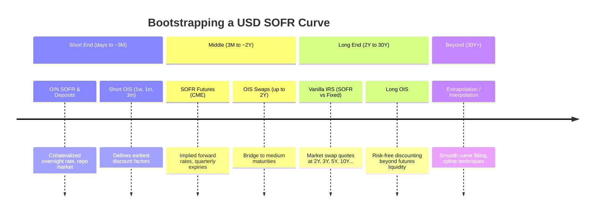

```mermaid
timeline
    title Bootstrapping a USD SOFR Curve
    section Short End (days to ~3M)
      O/N SOFR & Deposits : Collateralized overnight rate, repo market
      Short OIS (1w, 1m, 3m) : Defines earliest discount factors
    section Middle (3M to ~2Y)
      SOFR Futures (CME) : Implied forward rates, quarterly expiries
      OIS Swaps (up to 2Y) : Bridge to medium maturities
    section Long End (2Y to 30Y)
      Vanilla IRS (SOFR vs Fixed) : Market swap quotes at 2Y, 3Y, 5Y, 10Y...
      Long OIS : Risk-free discounting beyond futures liquidity
    section Beyond (30Y+)
      Extrapolation / Interpolation : Smooth curve fitting, spline techniques
```
