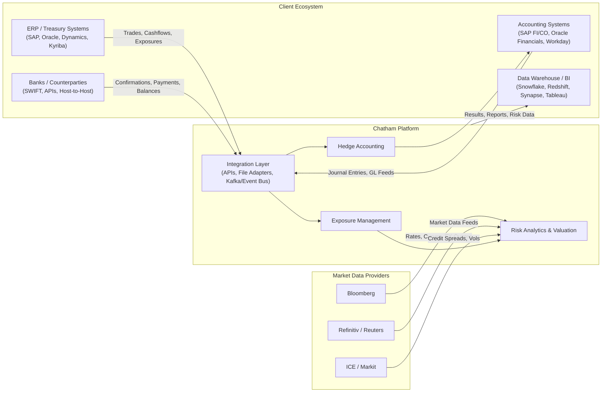

```mermaid
flowchart LR
    subgraph Client["Client Ecosystem"]
        ERP["ERP / Treasury Systems<br/>(SAP, Oracle, Dynamics, Kyriba)"]
        ACC["Accounting Systems<br/>(SAP FI/CO, Oracle Financials, Workday)"]
        BANK["Banks / Counterparties<br/>(SWIFT, APIs, Host-to-Host)"]
        DW["Data Warehouse / BI<br/>(Snowflake, Redshift, Synapse, Tableau)"]
    end

    subgraph MarketData["Market Data Providers"]
        BBG["Bloomberg"]
        REU["Refinitiv / Reuters"]
        ICE["ICE / Markit"]
    end

    subgraph Chatham["Chatham Platform"]
        EXP["Exposure Management"]
        RISK["Risk Analytics & Valuation"]
        HEDGE["Hedge Accounting"]
        API["Integration Layer<br/>(APIs, File Adapters, Kafka/Event Bus)"]
    end

    ERP -->|Trades, Cashflows, Exposures| API
    ACC -->|Journal Entries, GL Feeds| API
    BANK -->|Confirmations, Payments, Balances| API
    BBG -->|Rates, Curves, FX Quotes| RISK
    REU -->|Market Data Feeds| RISK
    ICE -->|Credit Spreads, Vols| RISK

    API --> EXP
    API --> HEDGE
    EXP --> RISK
    HEDGE --> ACC

    Chatham -->|Results, Reports, Risk Data| DW
```
