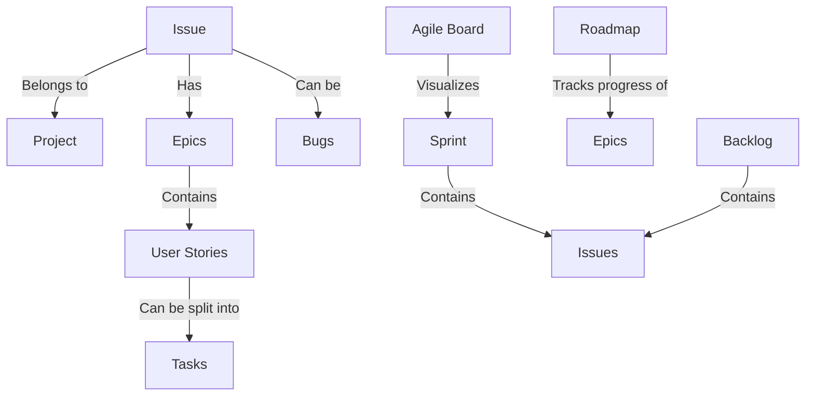
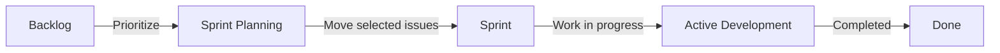
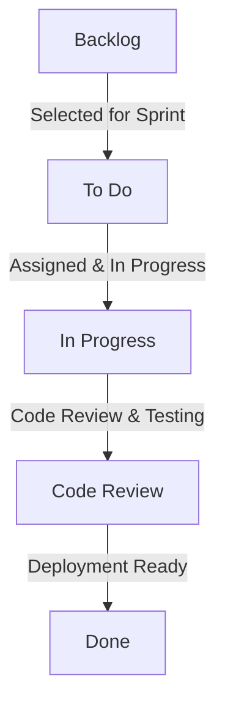
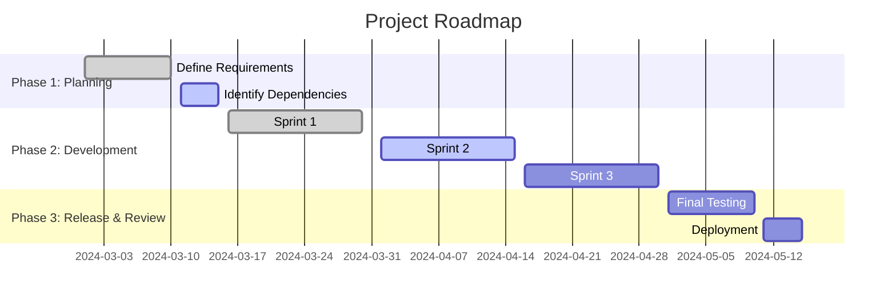

# 📌 Deep Research on Jira Concepts & Project Planning

Jira is **a powerful project management tool** used for **tracking issues, managing Agile workflows, and planning roadmaps**. This guide covers **core Jira concepts, how they link together, and how they can be used in project planning**.

📌 **Jira Official Documentation**: [Jira Docs](https://support.atlassian.com/jira-software-cloud/)  
📌 **Jira Agile Boards**: [Jira Agile Guide](https://www.atlassian.com/software/jira/agile)  
📌 **Jira Roadmaps**: [Jira Roadmap Guide](https://support.atlassian.com/jira-software-cloud/docs/what-is-a-roadmap/)  

---

## **1. Core Concepts in Jira**  

| Jira Concept | Description |
|-------------|------------|
| **Issue** | A generic work item (e.g., story, bug, task). |
| **Project** | A collection of issues managed together. |
| **Epic** | A large work item broken into smaller tasks. |
| **Story** | A user requirement that delivers value. |
| **Task** | A unit of work assigned to a person. |
| **Bug** | A reported defect or issue. |
| **Sprint** | A time-boxed iteration of work in Agile. |
| **Backlog** | A list of issues not yet in a sprint. |
| **Board** | A visual representation of workflow. |
| **Roadmap** | A timeline showing project progress. |

🔗 **More on Jira Concepts**: [Jira Overview](https://support.atlassian.com/jira-software-cloud/)  

---

## **2. How Jira Items Relate to Sprints**  

### **2.1 Sprint Workflow**  

### **2.2 Steps in Sprint Planning**  
1. **Refine the Backlog** – Ensure prioritized issues are well-defined.  
2. **Sprint Planning** – Move selected issues into the sprint.  
3. **Development & Testing** – Work on issues during the sprint.  
4. **Sprint Review** – Demonstrate completed work.  
5. **Sprint Retrospective** – Reflect and improve for next sprint.  

🔗 **More on Sprints**: [Jira Sprint Guide](https://support.atlassian.com/jira-software-cloud/docs/create-and-start-a-sprint/)  

---

## **3. Managing a Structured Agile Board**  

### **3.1 Board Columns & Workflow**  

### **3.2 Using Swimlanes for Organization**  
- **By Priority** – High, Medium, Low  
- **By Type** – Stories, Bugs, Tasks  
- **By Assignee** – Developer-specific tracking  

🔗 **More on Jira Boards**: [Jira Kanban Boards](https://support.atlassian.com/jira-software-cloud/docs/what-is-kanban/)  

---

## **4. Planning a Roadmap in Jira**  

### **4.1 Roadmap Structure**  

### **4.2 Steps to Create a Jira Roadmap**  
1. **Define Epics** – Break down large work items into smaller stories.  
2. **Set Dependencies** – Link issues that rely on each other.  
3. **Create a Timeline** – Assign start & end dates to epics.  
4. **Track Progress** – Update roadmap as issues are completed.  

🔗 **More on Roadmaps**: [Jira Roadmap Guide](https://support.atlassian.com/jira-software-cloud/docs/what-is-a-roadmap/)  

---

## **5. Best Practices for Project Planning in Jira**  

| Best Practice | Why It Matters |
|--------------|---------------|
| **Use Epics for Large Features** | Keeps the backlog structured. |
| **Break Down Work into Stories & Tasks** | Ensures manageable workload for sprints. |
| **Use Labels & Components** | Helps categorize and find issues easily. |
| **Automate Workflows** | Reduces manual effort using Jira automation. |
| **Monitor Velocity** | Helps track sprint performance. |

🔗 **More on Jira Best Practices**: [Jira Planning Guide](https://www.atlassian.com/agile/project-management)  

---

### **Final Thoughts**  
Jira is **a powerful tool for Agile project management**, enabling teams to **plan, track, and deliver software effectively**. By using **structured boards, backlogs, sprints, and roadmaps**, teams can **achieve better visibility and productivity**.

### **Happy Project Planning with Jira! 📌🚀**  
