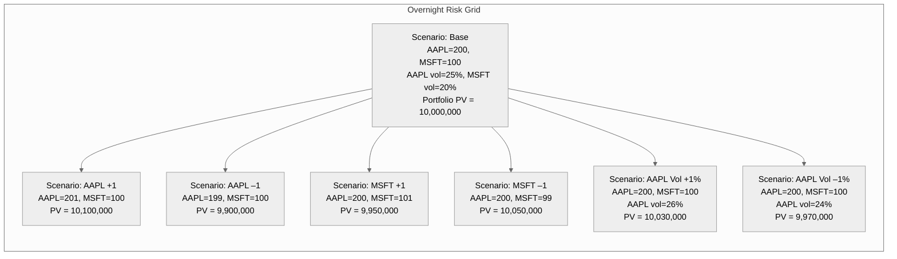

```mermaid
%%{init: {'theme': 'neutral'}}%%
grid
    columns 5
    Scenario  AAPL Price↓ | Vol –1% | Vol Base | Vol +1% | (interpretation)

    "Price –1 (199)"   9,970,000   | 9,900,000   | 9,930,000   | "Δ AAPL ≈ –100k, Vega ≈ +3m"
    "Price Base (200)" 9,970,000   | 10,000,000  | 10,030,000  | "Base PV"
    "Price +1 (201)"   10,070,000  | 10,100,000  | 10,130,000  | "Δ AAPL ≈ +100k, Vega ≈ +3m"
```

