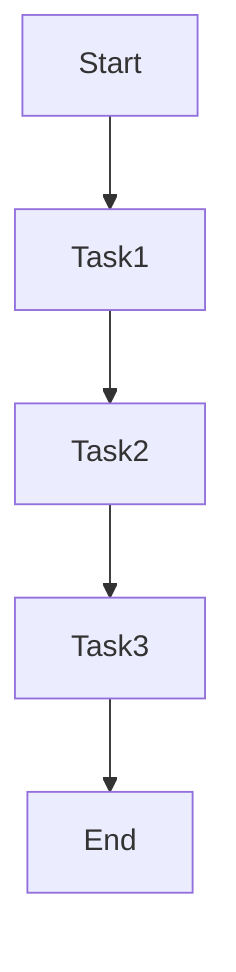

# 🌬️ Apache Airflow: Introduction & Getting Started Guide

Apache Airflow is a **workflow orchestration tool** that allows users to define, schedule, and monitor complex workflows as **Directed Acyclic Graphs (DAGs)**.

📌 **Official Documentation**: [Apache Airflow Docs](https://airflow.apache.org/docs/)  
📌 **GitHub Repository**: [Apache Airflow GitHub](https://github.com/apache/airflow)  

---

## **1. What is Apache Airflow?**  

Apache Airflow is an **open-source workflow automation tool** that allows users to define and manage **data pipelines**.

### **1.1 Key Features of Airflow**  
✅ **Dynamic Workflows** – DAGs define flexible pipelines.  
✅ **Scalability** – Supports distributed execution.  
✅ **Monitoring & Logging** – Web UI for tracking workflows.  
✅ **Integrations** – Works with databases, cloud services, and big data tools.  
✅ **Task Dependency Management** – Handles task execution order and retries.  

🔗 **More on Airflow Concepts**: [Apache Airflow Overview](https://airflow.apache.org/docs/apache-airflow/stable/concepts.html)  

---

## **2. Airflow Core Concepts**  

### **2.1 Directed Acyclic Graphs (DAGs)**  
A **DAG** represents a **workflow** and consists of **tasks with dependencies**.



| Concept | Description |
|---------|------------|
| **DAG** | A workflow represented as a graph of tasks. |
| **Task** | A unit of execution within a DAG. |
| **Operator** | Defines task behavior (e.g., Python, Bash, SQL). |
| **Scheduler** | Schedules and executes DAGs. |
| **Executor** | Determines how tasks are executed (Local, Celery, Kubernetes). |
| **Web UI** | Allows monitoring DAG runs and logs. |

🔗 **Understanding DAGs**: [Airflow DAGs](https://airflow.apache.org/docs/apache-airflow/stable/dag-run.html)  

---

## **3. Installing & Setting Up Airflow**  

### **3.1 Install Apache Airflow**  
```sh
pip install apache-airflow
```

### **3.2 Initialize Airflow Database**  
```sh
airflow db init
```

### **3.3 Start Airflow Services**  
```sh
airflow webserver --port 8080 &
airflow scheduler &
```

🔗 **More on Airflow Installation**: [Installation Guide](https://airflow.apache.org/docs/apache-airflow/stable/installation.html)  

---

## **4. Creating Your First DAG**  

### **4.1 Define a Simple DAG (`simple_dag.py`)**  
```python
from airflow import DAG
from airflow.operators.bash import BashOperator
from datetime import datetime

default_args = {
    "owner": "airflow",
    "start_date": datetime(2024, 1, 1),
    "retries": 1
}

with DAG("simple_dag", default_args=default_args, schedule_interval="@daily") as dag:
    task1 = BashOperator(
        task_id="print_hello",
        bash_command="echo 'Hello, Airflow!'"
    )
    task1  # Single task DAG
```

### **4.2 Add DAG to Airflow**  
1. Save the script in `$AIRFLOW_HOME/dags/`.  
2. Restart the scheduler:  
   ```sh
   airflow scheduler &
   ```
3. Open the **Airflow UI**: [http://localhost:8080](http://localhost:8080).  

🔗 **More on DAGs**: [Airflow DAG Guide](https://airflow.apache.org/docs/apache-airflow/stable/dag-run.html)  

---

## **5. Airflow Operators & Task Dependencies**  

### **5.1 Common Airflow Operators**  
| Operator | Description |
|----------|------------|
| `BashOperator` | Runs Bash commands. |
| `PythonOperator` | Runs Python scripts. |
| `PostgresOperator` | Executes SQL queries. |
| `S3FileTransformOperator` | Processes S3 data. |
| `KubernetesPodOperator` | Runs tasks in Kubernetes pods. |

### **5.2 Defining Task Dependencies**  
```python
task1 >> task2  # task2 runs after task1
task2 << task3  # task3 runs before task2
task1 >> [task2, task3]  # Parallel execution
```

🔗 **More on Operators**: [Airflow Operators](https://airflow.apache.org/docs/apache-airflow/stable/operators-and-hooks-ref.html)  

---

## **6. Scheduling & Monitoring Workflows**  

### **6.1 Schedule Intervals**  
| Schedule | Cron Format | Example |
|----------|------------|---------|
| `@daily` | `0 0 * * *` | Runs once a day |
| `@hourly` | `0 * * * *` | Runs every hour |
| `@weekly` | `0 0 * * 0` | Runs every Sunday |

```python
with DAG("my_dag", schedule_interval="0 6 * * *") as dag:
    task1 = BashOperator(...)
```

### **6.2 Monitoring with the Airflow UI**  
1. Open the UI at **[http://localhost:8080](http://localhost:8080)**.  
2. Check DAG status, logs, and execution history.  

🔗 **More on Scheduling**: [Airflow Scheduling](https://airflow.apache.org/docs/apache-airflow/stable/scheduler.html)  

---

## **7. Debugging & Logs in Airflow**  

### **7.1 View Logs via CLI**  
```sh
airflow tasks logs simple_dag print_hello
```

### **7.2 Debugging Common Issues**  
| Issue | Solution |
|-------|----------|
| DAG not appearing | Restart scheduler (`airflow scheduler &`) |
| Task failed | Check logs (`airflow tasks logs dag_id task_id`) |
| Web UI not loading | Restart webserver (`airflow webserver &`) |

🔗 **More on Debugging**: [Airflow Debugging](https://airflow.apache.org/docs/apache-airflow/stable/logging-monitoring/index.html)  

---

## **8. Real-World Use Cases for Apache Airflow**  

### ✅ **When to Use Apache Airflow**  

| Use Case | Why Airflow? |
|----------|-------------|
| **ETL & Data Pipelines** | Handles complex data workflows. |
| **Machine Learning Workflows** | Schedules training & inference jobs. |
| **Cloud Infrastructure Automation** | Automates deployments in AWS/GCP. |
| **Business Process Automation** | Manages repetitive workflows. |

🔗 **Airflow in Production**: [Airflow Use Cases](https://airflow.apache.org/docs/apache-airflow/stable/best-practices.html)  

---

## **9. When NOT to Use Airflow**  

| Limitation | Why It's a Problem |
|------------|------------------|
| **Short-lived jobs** | Overhead may be too high for simple scripts. |
| **Event-driven workflows** | Airflow is **time-based**, not event-driven. |
| **High-concurrency needs** | May not scale well without distributed execution. |

🔗 **Alternatives to Airflow**: [Luigi, Prefect](https://airflow.apache.org/docs/apache-airflow/stable/executor/index.html)  

---

### **Final Thoughts**  
Apache Airflow is a **powerful tool for managing workflows and data pipelines**. By leveraging **DAGs, operators, scheduling, and monitoring**, teams can **automate and optimize their processes**.

### **Happy Orchestrating with Apache Airflow! 🌬️🚀**  
