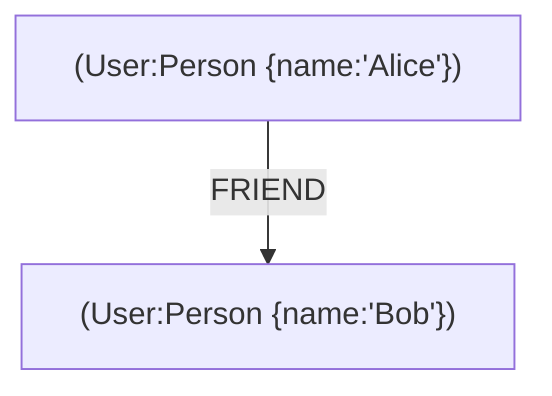

# 🔍 Deep Research & Learning Guide for Cypher (Graph Query Language)

Cypher is **a powerful graph query language** used for **querying and managing graph databases like Neo4j**. It is designed to express **complex graph patterns** in a human-readable syntax.

📌 **Official Neo4j Documentation**: [Neo4j Cypher Docs](https://neo4j.com/developer/cypher/)  
📌 **Cypher Query Language Reference**: [Cypher Reference](https://neo4j.com/docs/cypher-manual/current/)  
📌 **Cypher Online Playground**: [Neo4j Sandbox](https://neo4j.com/sandbox-v2/)  

---

## **1. What is Cypher?**  

Cypher is a **declarative language** used for **querying and manipulating graph data**. Unlike SQL (for relational databases), Cypher is optimized for handling **nodes, relationships, and properties** in graph databases.

### **1.1 Key Features of Cypher**  
✅ **Pattern-Based Queries** – Uses ASCII-art syntax for intuitive querying.  
✅ **Efficient Graph Traversals** – Optimized for **connected data** exploration.  
✅ **Declarative & Readable** – Similar to SQL but for graphs.  
✅ **Supports CRUD Operations** – Create, read, update, and delete graph elements.  
✅ **Aggregation & Path Finding** – Enables complex analysis of relationships.  

🔗 **More on Cypher Concepts**: [Cypher Overview](https://neo4j.com/developer/cypher/)  

---

## **2. Cypher Syntax & Query Structure**  



| Cypher Element | Description |
|---------------|------------|
| **Nodes (`(n)`)** | Represents entities like users, products, or locations. |
| **Relationships (`-[:TYPE]->`)** | Connects nodes (e.g., FRIEND, WORKS_AT). |
| **Properties (`{key: value}`)** | Stores attributes for nodes & relationships. |
| **Labels (`:Label`)** | Categorizes nodes into types. |

🔗 **More on Cypher Syntax**: [Cypher Syntax Guide](https://neo4j.com/docs/cypher-manual/current/syntax/)  

---

## **3. Getting Started with Cypher Queries**  

### **3.1 Creating a Graph**  
```cypher
CREATE (a:Person {name: 'Alice', age: 30})
CREATE (b:Person {name: 'Bob', age: 35})
CREATE (a)-[:FRIEND]->(b)
```

### **3.2 Querying Nodes & Relationships**  
```cypher
MATCH (p:Person) RETURN p.name, p.age
```

### **3.3 Finding Relationships**  
```cypher
MATCH (a:Person)-[r:FRIEND]->(b:Person) RETURN a.name, b.name
```

🔗 **More on Creating & Querying**: [Basic Cypher Queries](https://neo4j.com/developer/cypher-query-language/)  

---

## **4. Filtering & Query Optimization**  

### **4.1 Filtering with `WHERE`**  
```cypher
MATCH (p:Person)
WHERE p.age > 30
RETURN p.name, p.age
```

### **4.2 Using Indexes for Performance**  
```cypher
CREATE INDEX FOR (p:Person) ON (p.name)
```

🔗 **More on Query Optimization**: [Cypher Query Performance](https://neo4j.com/docs/cypher-manual/current/query-tuning/)  

---

## **5. Aggregations & Graph Analytics**  

### **5.1 Counting Nodes**  
```cypher
MATCH (p:Person) RETURN COUNT(p)
```

### **5.2 Finding Mutual Friends**  
```cypher
MATCH (a:Person)-[:FRIEND]-(mutual:Person)-[:FRIEND]-(b:Person)
WHERE a.name = 'Alice' AND b.name = 'Bob'
RETURN mutual.name
```

### **5.3 Path Finding (Shortest Path)**  
```cypher
MATCH path = shortestPath((a:Person)-[*]-(b:Person))
WHERE a.name = 'Alice' AND b.name = 'Eve'
RETURN path
```

🔗 **More on Graph Analytics**: [Graph Algorithms in Cypher](https://neo4j.com/developer/graph-data-science/)  

---

## **6. Updating & Deleting Graph Data**  

### **6.1 Updating Node Properties**  
```cypher
MATCH (p:Person {name: 'Alice'})
SET p.age = 31
RETURN p
```

### **6.2 Deleting Nodes & Relationships**  
```cypher
MATCH (p:Person {name: 'Bob'}) DETACH DELETE p
```

🔗 **More on Data Modification**: [Cypher Data Manipulation](https://neo4j.com/docs/cypher-manual/current/clauses/set/)  

---

## **7. Advanced Cypher Features**  

### **7.1 Using Variables for Reusability**  
```cypher
MATCH (p:Person)
WITH p.age AS age, COUNT(p) AS count
RETURN age, count ORDER BY age DESC
```

### **7.2 Merging Data to Avoid Duplicates**  
```cypher
MERGE (p:Person {name: 'Charlie'})
ON CREATE SET p.age = 28
ON MATCH SET p.updatedAt = timestamp()
RETURN p
```

🔗 **More on Advanced Cypher**: [Advanced Cypher Queries](https://neo4j.com/developer/cypher-query-language/)  

---

## **8. Debugging & Best Practices in Cypher**  

### **8.1 Debugging Queries with `EXPLAIN`**  
```cypher
EXPLAIN MATCH (p:Person) RETURN p
```

### **8.2 Using `PROFILE` for Execution Plan**  
```cypher
PROFILE MATCH (p:Person) RETURN p
```

### **8.3 Best Practices for Cypher Queries**  
| Best Practice | Why It Matters |
|--------------|---------------|
| **Use Indexes** | Speeds up searches. |
| **Limit Query Scope** | Improves performance on large graphs. |
| **Use Constraints** | Prevents duplicate data. |
| **Optimize Traversals** | Avoids unnecessary deep searches. |

🔗 **More on Cypher Performance**: [Neo4j Performance Tuning](https://neo4j.com/docs/cypher-manual/current/query-tuning/)  

---

### **Final Thoughts**  
Cypher is a **powerful and intuitive query language for graph databases**, allowing users to **traverse complex relationships efficiently**. By mastering **pattern-based queries, optimizations, and analytics**, developers can **leverage graph technology for real-world applications**.

### **Happy Querying with Cypher! 🔍🚀**  
