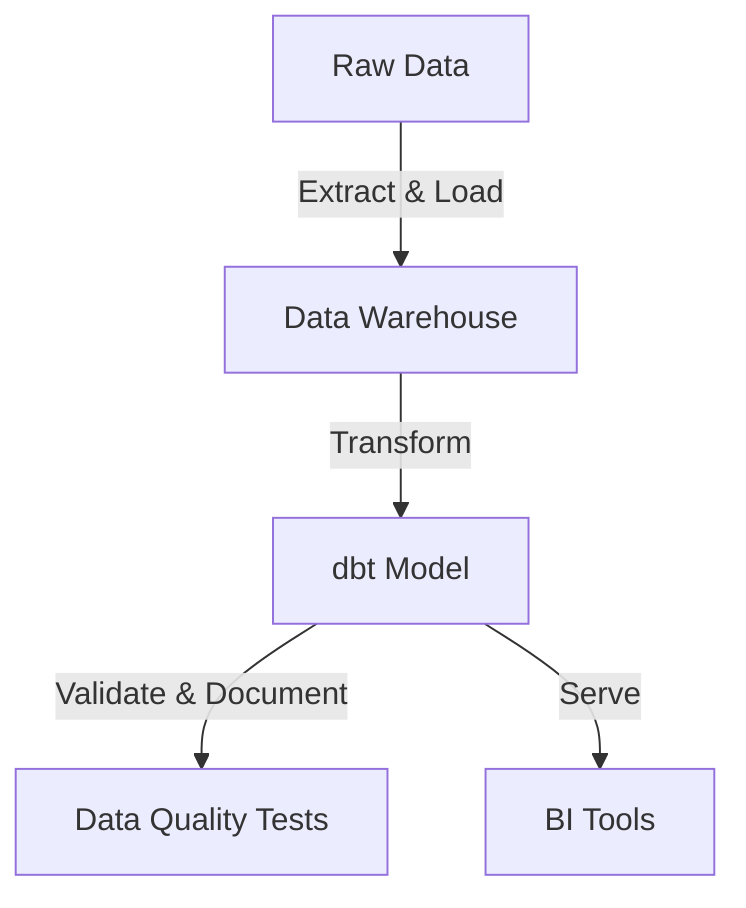

# 📊 Deep Research & Getting Started with dbt (Data Build Tool)

dbt (Data Build Tool) is **an open-source data transformation tool** that enables **analytics engineers to transform, test, and document data using SQL**.

📌 **Official Documentation**: [dbt Docs](https://docs.getdbt.com/)  
📌 **dbt GitHub Repository**: [dbt GitHub](https://github.com/dbt-labs/dbt-core)  
📌 **dbt Cloud**: [dbt Cloud](https://www.getdbt.com/)  

---

## **1. What is dbt?**  

dbt allows **analytics engineers** to **transform raw data into analytics-ready datasets** within a data warehouse using SQL.

### **1.1 Key Features of dbt**  
✅ **SQL-Based Transformations** – Write transformations using SQL.  
✅ **Version Control & CI/CD** – Integrates with Git for reproducibility.  
✅ **Data Lineage & Documentation** – Tracks dependencies and generates docs.  
✅ **Testing & Validation** – Ensures data quality with built-in tests.  
✅ **Modular & Scalable** – Encourages reusable SQL models.  

🔗 **More on dbt Concepts**: [dbt Overview](https://docs.getdbt.com/docs/introduction)  

---

## **2. How dbt Works**  



| Step | Description |
|------|------------|
| **Extract & Load** | Data is ingested into a warehouse (e.g., Snowflake, BigQuery, Redshift). |
| **Transform** | dbt applies SQL transformations to create analytics-ready datasets. |
| **Validate & Test** | dbt enforces data quality checks with assertions. |
| **Serve** | Data is made available to BI tools like Tableau, Looker, or Metabase. |

🔗 **More on dbt Architecture**: [dbt Workflow](https://docs.getdbt.com/docs/introduction/dbt-overview)  

---

## **3. Installing & Setting Up dbt**  

### **3.1 Installing dbt (CLI Method)**  
```sh
pip install dbt-core
```

### **3.2 Verify Installation**  
```sh
dbt --version
```

### **3.3 Initialize a New dbt Project**  
```sh
dbt init my_dbt_project
cd my_dbt_project
```

🔗 **More on dbt Installation**: [dbt Setup Guide](https://docs.getdbt.com/docs/get-started)  

---

## **4. Configuring dbt with a Data Warehouse**  

### **4.1 Supported Warehouses**  
| Data Warehouse | dbt Adapter |
|---------------|------------|
| **PostgreSQL** | `dbt-postgres` |
| **Snowflake** | `dbt-snowflake` |
| **BigQuery** | `dbt-bigquery` |
| **Redshift** | `dbt-redshift` |

### **4.2 Example Configuration for PostgreSQL (`profiles.yml`)**  
```yaml
my_dbt_project:
  target: dev
  outputs:
    dev:
      type: postgres
      host: localhost
      user: my_user
      password: my_password
      dbname: my_database
      schema: public
      threads: 4
```

🔗 **More on dbt Database Configs**: [dbt Connection Guide](https://docs.getdbt.com/docs/configure-your-database)  

---

## **5. Creating and Running a dbt Model**  

### **5.1 Define a dbt Model (`models/my_model.sql`)**  
```sql
SELECT 
    id, 
    name, 
    created_at::DATE AS created_date 
FROM raw_data.users
```

### **5.2 Run the dbt Model**  
```sh
dbt run
```

### **5.3 Viewing Model Lineage**  
```sh
dbt docs generate
dbt docs serve
```

🔗 **More on dbt Models**: [dbt Model Basics](https://docs.getdbt.com/docs/build/models)  

---

## **6. Testing and Validating Data in dbt**  

### **6.1 Adding Tests (`models/schema.yml`)**  
```yaml
version: 2

models:
  - name: my_model
    description: "A cleaned user dataset"
    columns:
      - name: id
        tests:
          - unique
          - not_null
```

### **6.2 Running Tests**  
```sh
dbt test
```

🔗 **More on dbt Testing**: [dbt Testing Guide](https://docs.getdbt.com/docs/build/tests)  

---

## **7. Using dbt Macros & Jinja for Advanced Transformations**  

### **7.1 Defining a Macro (`macros/custom_macro.sql`)**  
```sql

    CAST({{ column_name }} AS DATE)

```

### **7.2 Using the Macro in a Model (`models/my_model.sql`)**  
```sql
SELECT 
    id, 
    name, 
    {{ format_date("created_at") }} AS created_date
FROM raw_data.users
```

🔗 **More on dbt Macros**: [dbt Jinja Guide](https://docs.getdbt.com/docs/build/macros)  

---

## **8. Automating dbt with CI/CD**  

### **8.1 Running dbt in a CI/CD Pipeline (GitHub Actions)**  
```yaml
name: dbt CI Pipeline

on: [push]

jobs:
  dbt_run:
    runs-on: ubuntu-latest
    steps:
      - name: Checkout Repository
        uses: actions/checkout@v3

      - name: Set up Python
        uses: actions/setup-python@v3
        with:
          python-version: '3.9'

      - name: Install dbt
        run: pip install dbt-core dbt-postgres

      - name: Run dbt Models
        run: dbt run
```

🔗 **More on dbt CI/CD**: [dbt Cloud & CI/CD](https://docs.getdbt.com/docs/collaborate/using-continuous-integration)  

---

## **9. Debugging & Best Practices in dbt**  

### **9.1 Debugging dbt Errors**  
```sh
dbt debug  # Checks database connection & configuration
```

### **9.2 Best Practices for dbt Projects**  
| Best Practice | Why It Matters |
|--------------|---------------|
| **Use Modular Models** | Improves reusability and maintainability. |
| **Add Tests & Assertions** | Ensures data integrity. |
| **Use dbt Documentation** | Enhances data transparency. |
| **Leverage Macros & Jinja** | Simplifies repetitive SQL logic. |
| **Implement CI/CD for dbt** | Automates and validates transformations. |

🔗 **More on dbt Debugging**: [dbt Debug Guide](https://docs.getdbt.com/docs/build/debugging)  

---

### **Final Thoughts**  
dbt **simplifies data transformation and pipeline orchestration** by leveraging **SQL, modular modeling, testing, and CI/CD integration**. By implementing **best practices and automation**, teams can **ensure data quality and streamline analytics workflows**.

### **Happy Data Transforming with dbt! 📊🚀**  
