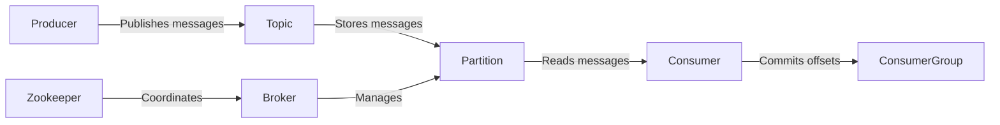
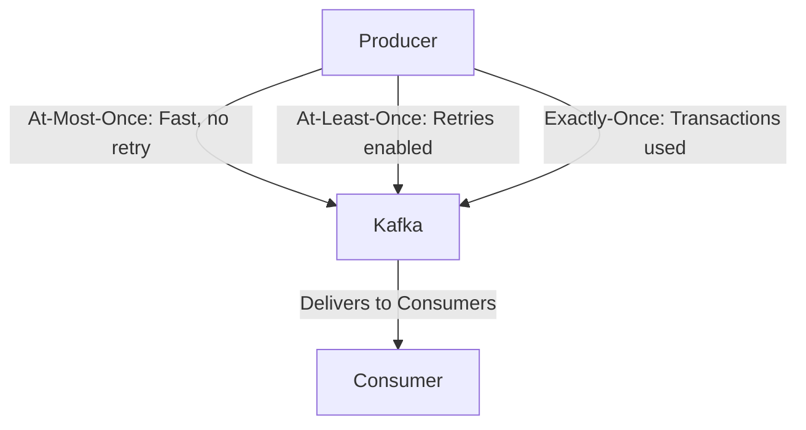
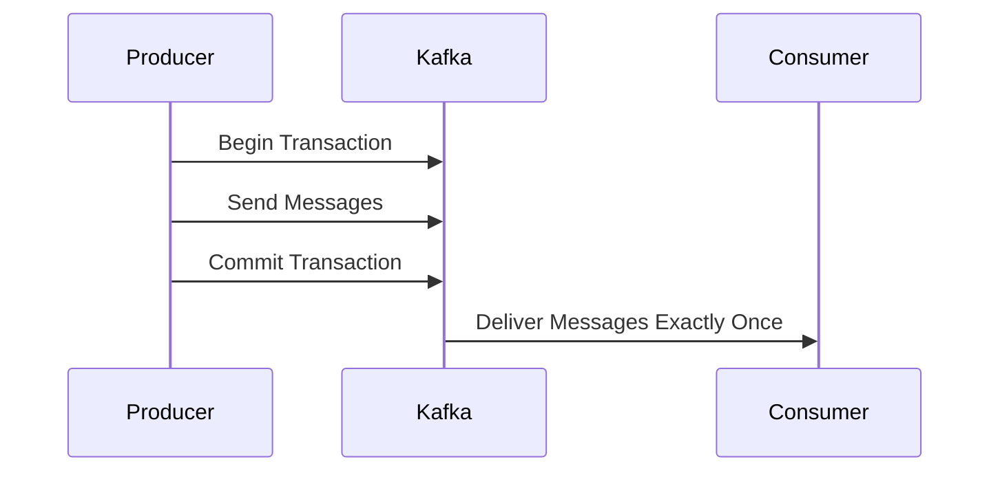

# 🔥 Kafka Deep Dive: Concepts, Exactly-Once Semantics & Architecture

Apache Kafka is a **distributed event streaming platform** used for **high-throughput messaging, real-time analytics, and event-driven architectures**. This guide covers **Kafka core concepts, exactly-once semantics, message delivery guarantees, and advanced Kafka internals**.

📌 **Kafka Documentation**: [Kafka Docs](https://kafka.apache.org/documentation/)  
📌 **Exactly-Once Semantics**: [Kafka EOS Guide](https://kafka.apache.org/documentation/#semantics)  
📌 **Kafka Streams**: [Kafka Streams Guide](https://kafka.apache.org/documentation/streams/)  

---

## **1. Kafka Architecture & Core Concepts**

Kafka is designed as a **high-throughput, fault-tolerant, and scalable** messaging system.

### **1.1 Kafka System Components**  


| Component      | Description |
|---------------|------------|
| **Producer**  | Sends messages to Kafka topics. |
| **Topic**     | Logical grouping of messages. |
| **Partition** | Distributed segments of a topic, ensuring parallelism. |
| **Consumer**  | Reads messages from a topic. |
| **Consumer Group** | Ensures multiple consumers can share load. |
| **Broker**    | Manages partitions and topics in Kafka. |
| **ZooKeeper** | Coordinates brokers (deprecated in future versions). |

🔗 **Kafka Architecture Overview**: [Kafka Core Concepts](https://kafka.apache.org/documentation/#intro_concepts_and_terms)  

---

## **2. Message Delivery Guarantees: At-Least-Once, At-Most-Once, Exactly-Once**  

Kafka provides **three levels of message delivery semantics**:

| Guarantee Type | Description |
|---------------|-------------|
| **At-Most-Once** | Messages are **never re-delivered** but may be lost. |
| **At-Least-Once** | Messages **are always delivered**, but duplicates are possible. |
| **Exactly-Once** | Messages **are delivered only once**, ensuring no duplicates. |



🔗 **Message Guarantees Explained**: [Kafka Semantics](https://kafka.apache.org/documentation/#semantics)  

---

## **3. Exactly-Once Semantics (EOS) in Kafka**  

Kafka ensures **exactly-once processing** using **transactions and idempotent producers**.

### **3.1 Enabling Exactly-Once Semantics**  
- **Idempotent Producer** (`enable.idempotence=true`) ensures unique message production.
- **Transactional Producer** groups operations into **atomic units**.

```properties
# Enable Exactly-Once Semantics in Kafka Producer
enable.idempotence=true
transactional.id=my-transactional-id
acks=all
```

### **3.2 Transactional Message Flow**  


🔗 **Kafka Transactions & EOS**: [Kafka Exactly-Once](https://kafka.apache.org/documentation/#semantics_explained)  

---

## **4. Kafka Streams: Real-Time Stream Processing**  

Kafka Streams enables **stateful and stateless** stream processing.

### **4.1 Stateless Transformations**  
| Operation | Description |
|-----------|------------|
| `mapValues()` | Transforms values in a stream. |
| `filter()` | Filters records based on conditions. |
| `flatMap()` | Expands records into multiple outputs. |

```java
KStream<String, String> stream = builder.stream("input-topic");
KStream<String, String> transformed = stream.mapValues(value -> value.toUpperCase());
transformed.to("output-topic");
```

### **4.2 Stateful Transformations (Windowing, Joins, Aggregations)**  
| Operation | Description |
|-----------|------------|
| `groupByKey()` | Groups records by key. |
| `reduce()` | Performs stateful aggregations. |
| `windowedBy()` | Groups data into time windows. |

```java
KTable<Windowed<String>, Long> windowedCounts = stream
    .groupByKey()
    .windowedBy(TimeWindows.of(Duration.ofMinutes(5)))
    .count();
```

🔗 **Kafka Streams Guide**: [Kafka Streams](https://kafka.apache.org/documentation/streams/)  

---

## **5. Kafka Monitoring & Performance Optimization**  

### **5.1 Monitoring Kafka Metrics**  
- **Consumer Lag**: Measures delay between producing and consuming messages.  
  ```sh
  kafka-consumer-groups --describe --group my-consumer-group
  ```
- **Broker Health**:  
  ```sh
  kafka-topics --describe --topic my-topic --bootstrap-server localhost:9092
  ```

### **5.2 Tuning Kafka Performance**  
| Optimization | Recommendation |
|-------------|---------------|
| **Batch Size** | Increase `batch.size` for higher throughput. |
| **Compression** | Use `lz4` or `snappy` for better efficiency. |
| **Acks Configuration** | Set `acks=all` for durability. |

```properties
# Optimized Kafka Producer Config
batch.size=16384
compression.type=lz4
acks=all
```

🔗 **Kafka Performance Tuning**: [Kafka Optimization Guide](https://kafka.apache.org/documentation/#design)  

---

## **6. Real-World Use Cases for Kafka**  

### ✅ **6.1 When Kafka is a Great Choice**  

| Use Case | Why Kafka? |
|----------|-----------|
| **Event-Driven Microservices** | High-throughput, real-time messaging. |
| **Log Aggregation** | Efficiently collects and streams logs. |
| **Real-Time Analytics** | Supports stream processing at scale. |
| **IoT Data Ingestion** | Handles large-scale sensor data ingestion. |

🔗 **Kafka Use Cases**: [Kafka in Production](https://kafka.apache.org/documentation/#usecases)  

---

## **7. When NOT to Use Kafka**  

| Limitation | Why It's a Problem |
|------------|------------------|
| **Low-Throughput Applications** | Overhead may be too high for small-scale systems. |
| **Strict ACID Transactions** | Kafka provides **eventual consistency**, not ACID compliance. |
| **Simple Message Queues** | For basic pub/sub, RabbitMQ may be a better fit. |

🔗 **Alternatives to Kafka**: [Kafka vs RabbitMQ](https://www.confluent.io/blog/kafka-vs-rabbitmq/)  

---

### **Final Thoughts**  
Kafka is a **high-performance, scalable event streaming platform**, ideal for **event-driven architectures, real-time analytics, and large-scale data pipelines**. With **exactly-once semantics, Kafka Streams, and performance optimizations**, organizations can **build robust and fault-tolerant data systems**.

### **Happy Streaming with Kafka! 🔥🚀**  
