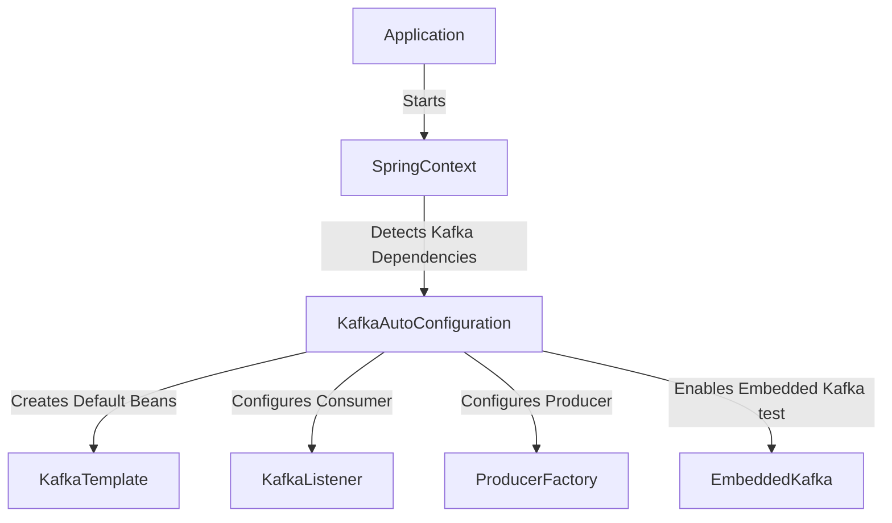

# 🚀 Getting Started with Kafka & Spring Boot

Apache Kafka **integrates seamlessly** with Spring Boot using **Spring Kafka**, enabling easy **producer, consumer, and streaming application development**. This guide covers **setting up Kafka in Spring Boot, understanding auto-configuration, and troubleshooting common issues**.

📌 **Spring Kafka Docs**: [Spring Kafka Reference](https://docs.spring.io/spring-kafka/docs/current/reference/html/)  
📌 **Spring Boot Autoconfiguration**: [Spring Boot Docs](https://docs.spring.io/spring-boot/docs/current/reference/html/)  
📌 **Kafka Spring Boot Example**: [Spring Boot Kafka GitHub](https://github.com/spring-projects/spring-kafka)  

---

## **1. How Spring Boot Autoconfigures Kafka**  

Spring Boot **automatically configures** Kafka using **Spring Boot Autoconfiguration**.

### **1.1 Spring Boot Kafka AutoConfiguration Flow**  


### **1.2 Default Kafka Beans Registered by Spring Boot**  
| Bean | Description |
|------|------------|
| `KafkaTemplate` | Handles message publishing. |
| `ConsumerFactory` | Creates Kafka consumers. |
| `ProducerFactory` | Creates Kafka producers. |
| `KafkaListenerContainerFactory` | Manages Kafka consumer listeners. |
| `EmbeddedKafka` | Provides in-memory Kafka for testing. |

🔗 **Spring Boot AutoConfiguration Docs**: [Spring Boot Kafka Autoconfig](https://docs.spring.io/spring-boot/docs/current/reference/html/messaging.html#messaging.kafka)  

---

## **2. Setting Up Kafka in a Spring Boot Application**  

### **2.1 Add Dependencies to `pom.xml`**  
```xml
<dependency>
    <groupId>org.springframework.kafka</groupId>
    <artifactId>spring-kafka</artifactId>
    <version>3.0.7</version>
</dependency>
```

### **2.2 Configure Kafka in `application.yml`**  
```yaml
spring:
  kafka:
    bootstrap-servers: localhost:9092
    producer:
      key-serializer: org.apache.kafka.common.serialization.StringSerializer
      value-serializer: org.apache.kafka.common.serialization.StringSerializer
    consumer:
      group-id: my-group
      key-deserializer: org.apache.kafka.common.serialization.StringDeserializer
      value-deserializer: org.apache.kafka.common.serialization.StringDeserializer
```

🔗 **Spring Kafka Configuration**: [Spring Kafka Properties](https://docs.spring.io/spring-boot/docs/current/reference/html/application-properties.html#application-properties.integration.spring-kafka)  

---

## **3. Implementing a Kafka Producer & Consumer in Spring Boot**  

### **3.1 Create a Kafka Producer Service**  
```java
import org.springframework.kafka.core.KafkaTemplate;
import org.springframework.stereotype.Service;

@Service
public class KafkaProducer {
    private final KafkaTemplate<String, String> kafkaTemplate;

    public KafkaProducer(KafkaTemplate<String, String> kafkaTemplate) {
        this.kafkaTemplate = kafkaTemplate;
    }

    public void sendMessage(String topic, String message) {
        kafkaTemplate.send(topic, message);
    }
}
```

### **3.2 Create a Kafka Consumer Listener**  
```java
import org.springframework.kafka.annotation.KafkaListener;
import org.springframework.stereotype.Service;

@Service
public class KafkaConsumer {
    @KafkaListener(topics = "my-topic", groupId = "my-group")
    public void consumeMessage(String message) {
        System.out.println("Received message: " + message);
    }
}
```

🔗 **Kafka Producer & Consumer Docs**: [Spring Kafka Messaging](https://docs.spring.io/spring-kafka/docs/current/reference/html/#kafka-template)  

---

## **4. Sending & Receiving Messages via REST API**  

### **4.1 Create a REST Controller for Producing Messages**  
```java
import org.springframework.web.bind.annotation.*;

@RestController
@RequestMapping("/kafka")
public class KafkaController {
    private final KafkaProducer kafkaProducer;

    public KafkaController(KafkaProducer kafkaProducer) {
        this.kafkaProducer = kafkaProducer;
    }

    @PostMapping("/send")
    public String sendMessage(@RequestParam String message) {
        kafkaProducer.sendMessage("my-topic", message);
        return "Message sent!";
    }
}
```

### **4.2 Test Kafka Producer API with `cURL`**  
```sh
curl -X POST "http://localhost:8080/kafka/send?message=HelloKafka"
```

🔗 **REST Integration with Kafka**: [Spring Kafka REST](https://docs.spring.io/spring-kafka/docs/current/reference/html/#template)  

---

## **5. Advanced Kafka Features in Spring Boot**  

### **5.1 Using Kafka Transactions (Exactly-Once Processing)**  
```yaml
spring:
  kafka:
    producer:
      enable-idempotence: true
      transactional-id: my-transactional-id
```

```java
@KafkaListener(topics = "my-topic", groupId = "my-group", containerFactory = "kafkaListenerContainerFactory")
@KafkaTransaction
public void consumeTransactionalMessage(String message) {
    System.out.println("Received transactional message: " + message);
}
```

🔗 **Kafka Transactions in Spring**: [Spring Kafka Transactions](https://docs.spring.io/spring-kafka/docs/current/reference/html/#transactions)  

---

## **6. Debugging & Troubleshooting Spring Kafka**  

### **6.1 Check Kafka Connectivity**  
```sh
kafka-topics --list --bootstrap-server localhost:9092
```

### **6.2 Check Consumer Group Status**  
```sh
kafka-consumer-groups --describe --group my-group --bootstrap-server localhost:9092
```

### **6.3 Debug Kafka Consumer Logging**  
Add in `application.properties` to **enable consumer logs**:  
```properties
logging.level.org.springframework.kafka.listener=DEBUG
```

🔗 **Troubleshooting Spring Kafka**: [Kafka Debugging](https://docs.spring.io/spring-kafka/docs/current/reference/html/#troubleshooting)  

---

### **Final Thoughts**  
Spring Boot makes **Kafka integration easy** with **auto-configuration, built-in templates, and listeners**. By **understanding the autoconfiguration process**, **creating producers/consumers**, and **enabling advanced features like transactions**, you can **leverage Kafka effectively in microservices architectures**.

### **Happy Messaging with Kafka & Spring Boot! 🚀🔥**  
