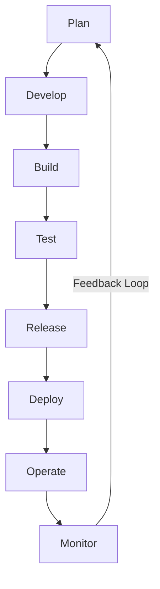

# ⚙️ DevOps Deep Dive: Concepts, Workflows & Best Practices

DevOps is a **cultural and technical approach** that bridges **development (Dev) and operations (Ops)** to enable **continuous delivery, automation, and collaboration**. This guide covers **core concepts, DevOps lifecycle, tools, best practices, and real-world use cases**.

📌 **DevOps Principles**: [DevOps Guide](https://aws.amazon.com/devops/what-is-devops/)  
📌 **CI/CD Best Practices**: [CI/CD Pipelines](https://martinfowler.com/articles/continuous-integration.html)  
📌 **Infrastructure as Code (IaC)**: [Terraform Docs](https://developer.hashicorp.com/terraform/docs)  

---

## **1. What is DevOps?**  

DevOps is **a methodology that integrates software development (Dev) with IT operations (Ops)** to accelerate the software delivery lifecycle. It promotes **automation, collaboration, and continuous feedback**.

### **1.1 Key Principles of DevOps**  
1. **Collaboration & Communication** – Breaks silos between Dev & Ops teams.  
2. **Continuous Integration & Continuous Deployment (CI/CD)** – Automates software release cycles.  
3. **Infrastructure as Code (IaC)** – Manages infrastructure declaratively.  
4. **Monitoring & Feedback Loops** – Enables proactive issue detection.  
5. **Security (DevSecOps)** – Integrates security into CI/CD pipelines.  

🔗 **More on DevOps Principles**: [DevOps Explained](https://www.atlassian.com/devops)  

---

## **2. DevOps Lifecycle & Workflow**  

### **2.1 DevOps Lifecycle Phases**  



| Phase       | Description |
|------------|------------|
| **Plan**   | Define requirements and user stories. |
| **Develop** | Write code and commit changes. |
| **Build**   | Compile and package the application. |
| **Test**    | Automate tests to validate quality. |
| **Release** | Manage versioning and approvals. |
| **Deploy**  | Deploy to production or staging environments. |
| **Operate** | Maintain system health and reliability. |
| **Monitor** | Gather insights via logs, metrics, and alerts. |

🔗 **DevOps Lifecycle Explained**: [Atlassian DevOps](https://www.atlassian.com/devops)  

---

## **3. DevOps Toolchain & Ecosystem**  

### **3.1 Core DevOps Tools by Category**  

| Category  | Tools |
|-----------|------|
| **Version Control** | Git, GitHub, GitLab, Bitbucket |
| **CI/CD Pipelines** | Jenkins, GitHub Actions, GitLab CI/CD, CircleCI |
| **Configuration Management** | Ansible, Chef, Puppet |
| **Infrastructure as Code (IaC)** | Terraform, CloudFormation |
| **Containerization & Orchestration** | Docker, Kubernetes |
| **Monitoring & Logging** | Prometheus, Grafana, ELK Stack |
| **Security & Compliance** | Snyk, Aqua, HashiCorp Vault |

🔗 **DevOps Tools Overview**: [CNCF Landscape](https://landscape.cncf.io/)  

---

## **4. Implementing DevOps in a CI/CD Pipeline**  

### **4.1 Example: CI/CD Workflow using GitHub Actions & Kubernetes**  

#### **Step 1: Define a CI/CD Pipeline in GitHub Actions**
```yaml
name: CI/CD Pipeline

on: [push, pull_request]

jobs:
  build:
    runs-on: ubuntu-latest
    steps:
      - name: Checkout Code
        uses: actions/checkout@v2

      - name: Build Docker Image
        run: docker build -t my-app:latest .

      - name: Run Tests
        run: ./test.sh

      - name: Push Image to Docker Hub
        run: docker push my-app:latest

  deploy:
    needs: build
    runs-on: ubuntu-latest
    steps:
      - name: Deploy to Kubernetes
        run: kubectl apply -f k8s/deployment.yaml
```

🔗 **GitHub Actions Guide**: [GitHub CI/CD](https://docs.github.com/en/actions)  

---

## **5. Best Practices for DevOps Adoption**  

### ✅ **5.1 DevOps Best Practices**  
1. **Automate Everything** – CI/CD, testing, infrastructure, security.  
2. **Use Infrastructure as Code (IaC)** – Manage infrastructure declaratively.  
3. **Shift Left on Security (DevSecOps)** – Detect security issues earlier.  
4. **Implement Observability** – Monitor logs, metrics, and tracing.  
5. **Adopt GitOps for Kubernetes** – Use FluxCD or ArgoCD for deployments.  

🔗 **DevOps Security Best Practices**: [OWASP DevSecOps](https://owasp.org/www-project-devsecops/)  

---

## **6. Real-World Use Cases for DevOps**  

### ✅ **6.1 When DevOps is a Great Choice**  

| Use Case | Why DevOps? |
|----------|------------|
| **Cloud-Native Applications** | Automates cloud deployments & scaling. |
| **Microservices Architecture** | CI/CD enables rapid service iteration. |
| **E-Commerce Platforms** | Ensures high availability & reliability. |
| **AI/ML Pipelines** | Automates model deployment & monitoring. |

🔗 **Case Study: Netflix & DevOps**: [Netflix Chaos Engineering](https://netflixtechblog.com/)  

---

## **7. When NOT to Use DevOps**  

| Limitation | Why It's a Problem |
|------------|------------------|
| **Legacy Systems** | May not support modern automation tools. |
| **Highly Regulated Industries** | Compliance requirements may restrict DevOps adoption. |
| **Small Teams** | Overhead of DevOps tools may not be justified. |

🔗 **Challenges of DevOps**: [DevOps Risks](https://www.thoughtworks.com/insights/blog/devops-security)  

---

### **Final Thoughts**  
DevOps enables **faster software delivery, greater reliability, and automation-first workflows**. Whether implementing **CI/CD, Kubernetes, or Infrastructure as Code**, adopting DevOps principles helps organizations **accelerate innovation while improving security and resilience**.

### **Happy Automating with DevOps! ⚙️🚀**  
