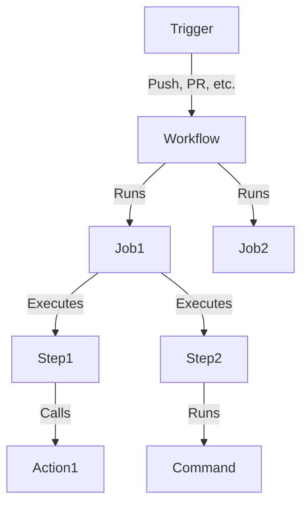

# 🚀 GitHub Actions: CI/CD Automation Guide

GitHub Actions is **a powerful CI/CD automation tool** that enables developers to **automate workflows** like **building, testing, and deploying applications directly from GitHub repositories**.

📌 **GitHub Actions Documentation**: [GitHub Actions Docs](https://docs.github.com/en/actions)  
📌 **GitHub Actions Marketplace**: [Actions Marketplace](https://github.com/marketplace?type=actions)  

---

## **1. What is GitHub Actions?**  

GitHub Actions **automates software workflows** by running **custom scripts** in response to Git events (push, pull request, issue creation, etc.).

### **1.1 Key Features of GitHub Actions**  
✅ **Event-driven** – Triggers workflows on push, PRs, issues, etc.  
✅ **Integrated with GitHub** – Runs directly in repositories.  
✅ **Multi-platform** – Supports Linux, macOS, and Windows runners.  
✅ **Reusable Workflows** – Use community or custom actions.  
✅ **Built-in Secrets Management** – Secure credentials handling.  

🔗 **More on GitHub Actions**: [GitHub Actions Guide](https://docs.github.com/en/actions)  

---

## **2. How GitHub Actions Works**  

GitHub Actions consists of **Workflows, Jobs, Steps, and Actions**:



| Component | Description |
|-----------|------------|
| **Workflow** | Defines automation (CI/CD pipeline). |
| **Job** | A set of steps executed in an environment. |
| **Step** | Individual commands within a job. |
| **Action** | Reusable automation scripts. |
| **Runner** | Executes jobs (GitHub-hosted or self-hosted). |

🔗 **GitHub Actions Workflow Basics**: [GitHub Actions Workflow](https://docs.github.com/en/actions/using-workflows)  

---

## **3. Creating a GitHub Actions Workflow**  

### **3.1 Setting Up a Workflow**  

Workflows are defined in `.github/workflows/` as **YAML files**.

### **3.2 Example: Simple CI Workflow**  
This workflow **runs on every push**, installs dependencies, and runs tests:

```yaml
name: CI Pipeline

on: [push]

jobs:
  build:
    runs-on: ubuntu-latest
    steps:
      - name: Checkout Repository
        uses: actions/checkout@v3

      - name: Set up Node.js
        uses: actions/setup-node@v3
        with:
          node-version: '18'

      - name: Install Dependencies
        run: npm install

      - name: Run Tests
        run: npm test
```

### **3.3 Example: Deploy to Production**  
Deploys an application **when pushing to the main branch**:

```yaml
name: Deploy

on:
  push:
    branches:
      - main

jobs:
  deploy:
    runs-on: ubuntu-latest

    steps:
      - name: Checkout Repository
        uses: actions/checkout@v3

      - name: Deploy Application
        run: |
          echo "Deploying application..."
          ssh user@server "cd /app && git pull && systemctl restart app"
```

🔗 **GitHub Actions Events & Triggers**: [GitHub Actions Events](https://docs.github.com/en/actions/using-workflows/events-that-trigger-workflows)  

---

## **4. Using Secrets & Environment Variables**  

### **4.1 Setting Up Secrets in GitHub**  
- Navigate to **Repository → Settings → Secrets and Variables**  
- Add a new secret (e.g., `DEPLOY_KEY`).  

### **4.2 Using Secrets in Workflows**  
```yaml
jobs:
  deploy:
    runs-on: ubuntu-latest
    steps:
      - name: Deploy Securely
        run: echo "Deploying with secret: ${{ secrets.DEPLOY_KEY }}"
```

🔗 **GitHub Secrets Guide**: [Using Secrets](https://docs.github.com/en/actions/security-guides/encrypted-secrets)  

---

## **5. Running Workflows Manually**  

You can **trigger workflows manually** using `workflow_dispatch`:

```yaml
on:
  workflow_dispatch:
```

Manually trigger workflows from the **Actions tab** in GitHub.

🔗 **Manual Workflow Triggers**: [Workflow Dispatch](https://docs.github.com/en/actions/using-workflows/events-that-trigger-workflows#workflow_dispatch)  

---

## **6. Reusable Workflows & Marketplace Actions**  

### **6.1 Using a Reusable Action from GitHub Marketplace**  
```yaml
steps:
  - name: Lint Code
    uses: super-linter/super-linter@v4
```

🔗 **GitHub Actions Marketplace**: [Find Actions](https://github.com/marketplace?type=actions)  

---

## **7. Debugging GitHub Actions**  

### **7.1 Viewing Workflow Logs**  
- Navigate to **GitHub Repo → Actions → Select Workflow Run**  
- View logs for each step  

### **7.2 Using Debug Mode**  
Add debugging logs:
```yaml
jobs:
  debug:
    runs-on: ubuntu-latest
    steps:
      - run: echo "::debug::This is a debug message"
```

🔗 **GitHub Actions Debugging**: [Debugging Guide](https://docs.github.com/en/actions/monitoring-and-troubleshooting-workflows)  

---

## **8. Real-World Use Cases for GitHub Actions**  

### ✅ **When GitHub Actions is Useful**  

| Use Case | Why Use GitHub Actions? |
|----------|--------------------------|
| **CI/CD Pipelines** | Automates testing and deployment |
| **Scheduled Tasks** | Runs maintenance scripts on schedule |
| **Code Quality Checks** | Enforces linting and security checks |
| **Docker Image Builds** | Automatically builds and pushes images |
| **Infrastructure as Code (IaC)** | Deploys Terraform, Kubernetes, etc. |

🔗 **GitHub Actions Use Cases**: [GitHub Actions Blog](https://github.blog/category/engineering/)  

---

### **Final Thoughts**  
GitHub Actions provides **powerful automation** for CI/CD, infrastructure, and DevOps workflows. By leveraging **workflows, jobs, actions, and secrets**, developers can **streamline deployments and testing**.

### **Happy Automating with GitHub Actions! 🚀**  
