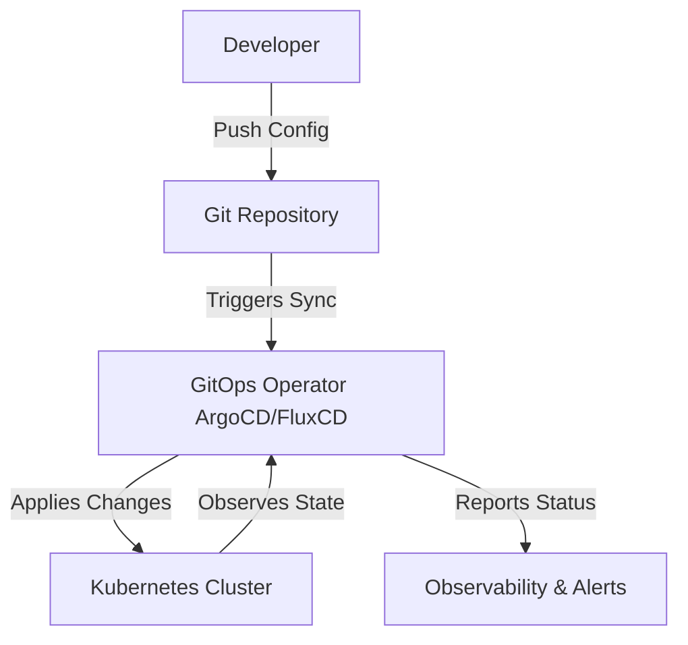

# 🔄 GitOps Deep Dive: Concepts, Workflows & Best Practices

GitOps is a **DevOps methodology** that uses **Git as the single source of truth** for **Kubernetes and cloud infrastructure management**. This guide covers **core concepts, workflows, tooling, best practices, and real-world use cases**.

📌 **GitOps Official Guide**: [GitOps Principles](https://opengitops.dev/)  
📌 **FluxCD Documentation**: [FluxCD](https://fluxcd.io/docs/)  
📌 **ArgoCD Documentation**: [ArgoCD](https://argo-cd.readthedocs.io/en/stable/)  

---

## **1. What is GitOps?**  

GitOps is a **declarative approach to infrastructure and application management**, where Git **acts as the source of truth** and automated reconciliation ensures infrastructure matches the desired state.

### **1.1 Key Principles of GitOps**  
1. **Declarative Configuration** – Infrastructure & applications are defined as code.  
2. **Version Control (Git)** – All changes are stored in Git with history & rollback.  
3. **Automated Synchronization** – Continuous reconciliation ensures infrastructure matches Git.  
4. **Continuous Deployment (CD)** – Changes in Git trigger automated deployments.  

🔗 **More on GitOps Principles**: [GitOps Principles](https://opengitops.dev/)  

---

## **2. GitOps Workflow Overview**  

### **2.1 Standard GitOps Deployment Workflow**  



### **2.2 GitOps with ArgoCD vs FluxCD**  

| Feature        | ArgoCD | FluxCD |
|---------------|--------|--------|
| UI Dashboard  | ✅ Yes | ❌ No  |
| CLI Management | ✅ Yes | ✅ Yes |
| Helm Support  | ✅ Yes | ✅ Yes |
| Multi-Tenancy | ✅ Yes | ✅ Yes |
| Pull-Based Sync | ✅ Yes | ✅ Yes |

🔗 **GitOps Tools Comparison**: [ArgoCD vs FluxCD](https://argo-cd.readthedocs.io/en/stable/comparison/)  

---

## **3. GitOps Tools & Ecosystem**  

### **3.1 Core GitOps Tools**  

| Tool | Purpose |
|------|---------|
| **ArgoCD** | UI-driven GitOps CD for Kubernetes |
| **FluxCD** | Lightweight GitOps tool with Helm support |
| **Kustomize** | Declarative Kubernetes configuration |
| **Terraform** | Infrastructure as Code for GitOps |

🔗 **FluxCD Guide**: [FluxCD Documentation](https://fluxcd.io/docs/)  
🔗 **ArgoCD Guide**: [ArgoCD Documentation](https://argo-cd.readthedocs.io/en/stable/)  

---

## **4. Implementing GitOps in Kubernetes**  

### **4.1 Setup GitOps with FluxCD**  

#### **Install FluxCD**  
```sh
kubectl apply -f https://github.com/fluxcd/flux2/releases/latest/install.yaml
```

#### **Bootstrap GitOps Repo**
```sh
flux bootstrap github --owner=my-org --repository=my-gitops-repo --branch=main
```

### **4.2 Setup GitOps with ArgoCD**  

#### **Install ArgoCD**
```sh
kubectl create namespace argocd
kubectl apply -n argocd -f https://raw.githubusercontent.com/argoproj/argo-cd/stable/manifests/install.yaml
```

#### **Deploy an Application with ArgoCD**
```sh
argocd app create my-app --repo https://github.com/myorg/myapp.git --path k8s --dest-server https://kubernetes.default.svc --dest-namespace myapp
```

🔗 **ArgoCD Application Setup**: [ArgoCD Quickstart](https://argo-cd.readthedocs.io/en/stable/getting_started/)  

---

## **5. Best Practices for GitOps**  

### **5.1 Maintain a Clean Git Repository**  
- Store **only declarative configurations** (e.g., Helm, Kustomize, Terraform).  
- Avoid **secrets** (use sealed-secrets or external vaults).  

### **5.2 Use Branch-Based Workflows**  
- **Main branch** → Stable production deployments.  
- **Feature branches** → New changes tested in staging environments.  

### **5.3 Enable Observability & Alerts**  
- Use **Prometheus + Grafana** for monitoring.  
- Set up **Slack alerts** for deployment failures.  

🔗 **GitOps Security Best Practices**: [CNCF GitOps Guide](https://opengitops.dev/)  

---

## **6. Real-World Use Cases for GitOps**  

### ✅ **6.1 When GitOps is a Great Choice**  

| Use Case | Why GitOps? |
|----------|------------|
| **Multi-Cluster Deployments** | Sync multiple Kubernetes clusters via Git |
| **Microservices CI/CD** | Automated rollouts based on Git commits |
| **Disaster Recovery** | Easily rollback infrastructure with Git history |
| **Highly Regulated Environments** | Enforce compliance with Git-based audit logs |

🔗 **GitOps in the Enterprise**: [WeaveWorks GitOps](https://www.weave.works/blog/what-is-gitops-really)  

---

## **7. When NOT to Use GitOps**  

| Limitation | Why It's a Problem |
|------------|------------------|
| **Manual Intervention Needed** | GitOps assumes full automation |
| **High-Frequency Deployments** | GitOps may add unnecessary commits |
| **Non-Kubernetes Workloads** | Designed primarily for Kubernetes |
| **Application State Management** | Not ideal for database migrations |

🔗 **GitOps Challenges**: [GitOps Limitations](https://opengitops.dev/)  

---

### **Final Thoughts**  
GitOps is a **powerful framework** that brings **automation, security, and consistency** to Kubernetes-based workflows. With tools like **ArgoCD and FluxCD**, teams can achieve **faster deployments, easier rollbacks, and audit-compliant workflows**.

### **Happy Automating with GitOps! 🔄🚀**  
