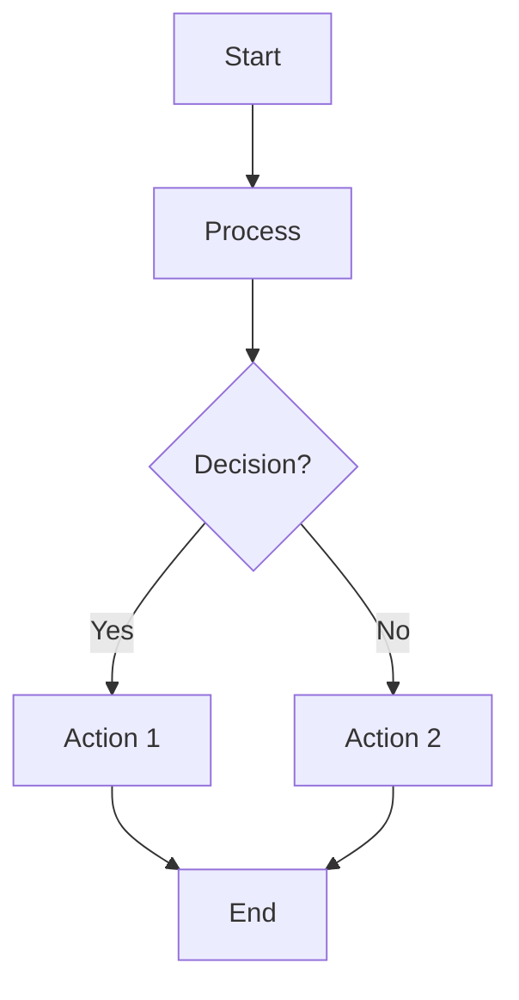
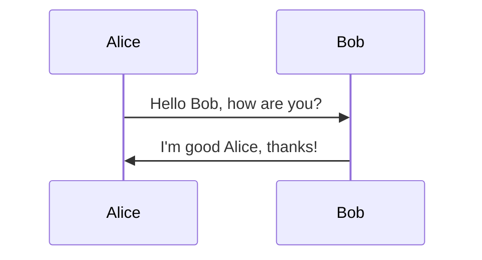
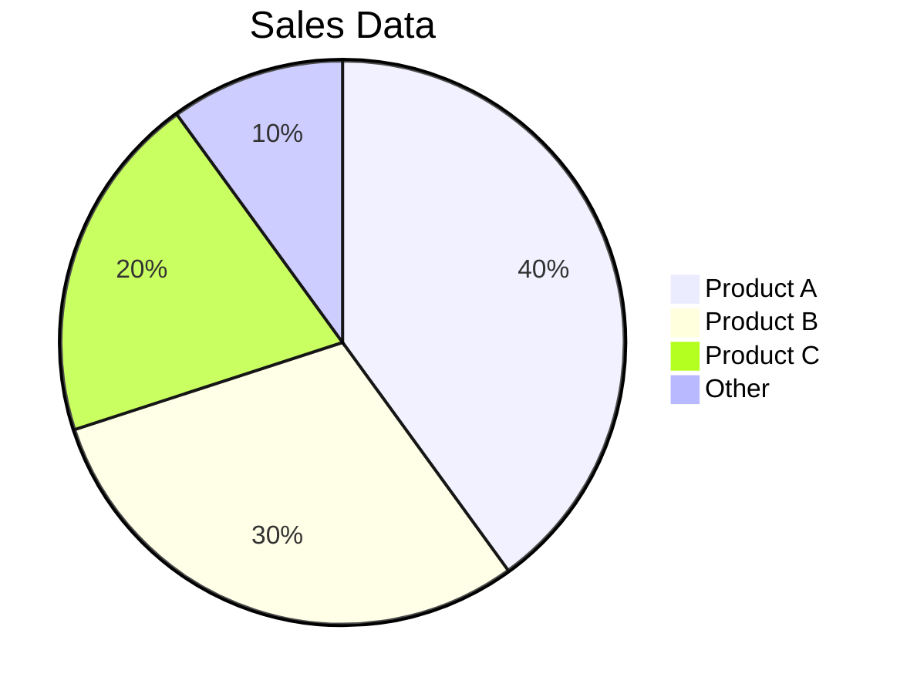
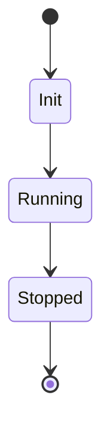
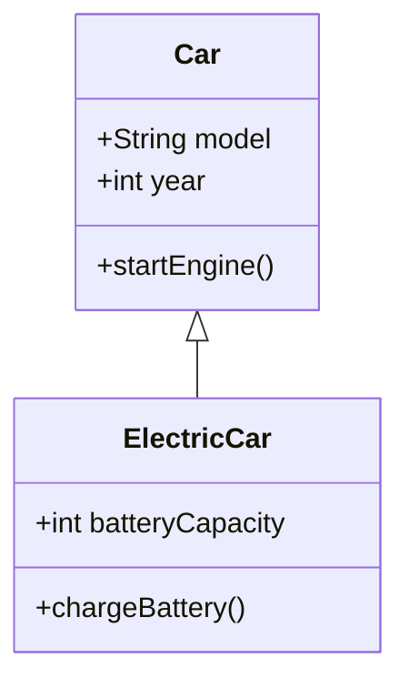

# 🎨 Mermaid Diagrams Cheat Sheet

Mermaid is a **text-based diagramming tool** that allows users to create **flowcharts, sequence diagrams, Gantt charts, and more** using simple syntax.

📌 **Official Documentation**: [Mermaid Docs](https://mermaid-js.github.io/)  
📌 **Live Editor**: [Mermaid Live Editor](https://mermaid-js.github.io/mermaid-live-editor/)  

---

## **1. Basic Flowchart**  

### **Diagram Output:**


### **Code Example:**
````markdown

````

🔗 **More on Flowcharts**: [Flowchart Docs](https://mermaid-js.github.io/mermaid/#/flowchart)  

---

## **2. Sequence Diagram**  

### **Diagram Output:**


### **Code Example:**
````markdown

````

🔗 **More on Sequence Diagrams**: [Sequence Docs](https://mermaid-js.github.io/mermaid/#/sequenceDiagram)  

---

## **3. Gantt Chart**  

### **Diagram Output:**
```mermaid
gantt;
    title Project Timeline
    section Development
    Task 1 :a1, 2024-03-01, 5d
    Task 2 :after a1, 3d
    section Testing
    Unit Tests :2024-03-10, 4d
    Integration Tests :2024-03-14, 3d
```

### **Code Example:**
````markdown
```mermaid
gantt;
    title Project Timeline
    section Development
    Task 1 :a1, 2024-03-01, 5d
    Task 2 :after a1, 3d
    section Testing
    Unit Tests :2024-03-10, 4d
    Integration Tests :2024-03-14, 3d
```
````

🔗 **More on Gantt Charts**: [Gantt Docs](https://mermaid-js.github.io/mermaid/#/gantt)  

---

## **4. Pie Chart**  

### **Diagram Output:**


### **Code Example:**
````markdown

````

🔗 **More on Pie Charts**: [Pie Chart Docs](https://mermaid-js.github.io/mermaid/#/pie)  

---

## **5. State Diagram**  

### **Diagram Output:**


### **Code Example:**
````markdown

````

🔗 **More on State Diagrams**: [State Diagram Docs](https://mermaid-js.github.io/mermaid/#/stateDiagram)  

---

## **6. Class Diagram**  

### **Diagram Output:**


### **Code Example:**
````markdown

````

🔗 **More on Class Diagrams**: [Class Diagram Docs](https://mermaid-js.github.io/mermaid/#/classDiagram)  

---

### **Final Thoughts**  
Mermaid.js is **a powerful tool for visualizing processes and relationships** in **flowcharts, sequence diagrams, Gantt charts, and more**. It is **easy to integrate into documentation, Markdown, and web applications**.

### **Happy Diagramming with Mermaid! 🎨🚀**  
