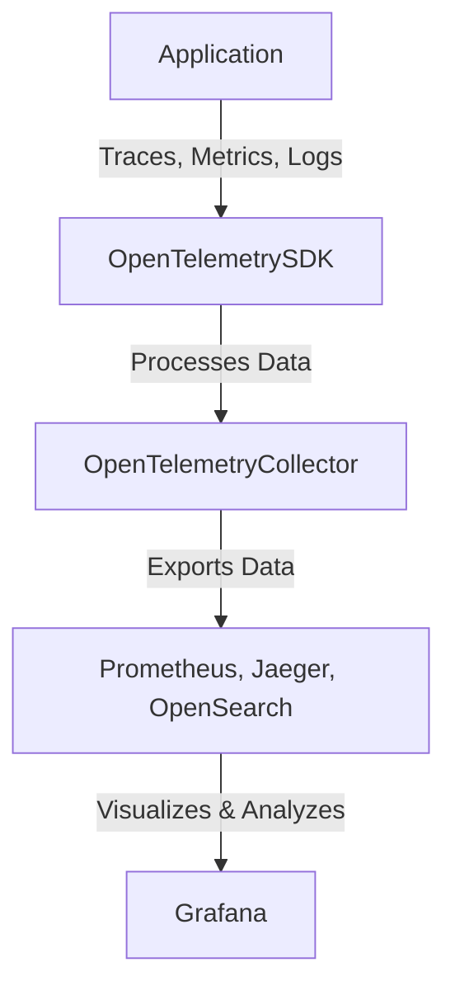

# 🔍 Deep Research on OpenTelemetry & Spring Boot Integration

OpenTelemetry is an **observability framework** for **tracing, metrics, and logs**, designed to provide **insights into distributed systems**.

📌 **OpenTelemetry Docs**: [Official OpenTelemetry](https://opentelemetry.io/docs/)  
📌 **Spring Boot OpenTelemetry Integration**: [Spring Observability](https://spring.io/blog/2023/04/19/observability-with-opentelemetry)  
📌 **Jaeger Tracing**: [Jaeger Docs](https://www.jaegertracing.io/docs/)  

---

## **1. What is OpenTelemetry?**  

OpenTelemetry (OTel) is **a vendor-neutral standard** for **instrumenting applications** to collect **traces, metrics, and logs**.

### **1.1 Key Features of OpenTelemetry**  
✅ **Unified Observability** – Traces, metrics, and logs in one framework.  
✅ **Language Agnostic** – Works with Java, Python, Go, etc.  
✅ **Supports Multiple Backends** – Exports data to Prometheus, Jaeger, OpenSearch, etc.  
✅ **Auto-Instrumentation** – No need to modify application code.  
✅ **Distributed Tracing** – Tracks requests across microservices.  

🔗 **More on OpenTelemetry**: [OTel Overview](https://opentelemetry.io/docs/)  

---

## **2. OpenTelemetry Architecture & Components**  



| Component | Description |
|-----------|------------|
| **Instrumentation SDK** | Captures application metrics & traces. |
| **OTel Collector** | Aggregates and exports telemetry data. |
| **Backends** | Stores data for analysis (Jaeger, Prometheus, etc.). |

🔗 **More on OpenTelemetry Architecture**: [OTel Components](https://opentelemetry.io/docs/concepts/components/)  

---

## **3. Setting Up OpenTelemetry for Spring Boot**  

### **3.1 Add Dependencies (`pom.xml`)**  
```xml
<dependency>
    <groupId>io.opentelemetry</groupId>
    <artifactId>opentelemetry-api</artifactId>
    <version>1.28.0</version>
</dependency>
<dependency>
    <groupId>io.opentelemetry</groupId>
    <artifactId>opentelemetry-exporter-jaeger</artifactId>
    <version>1.28.0</version>
</dependency>
<dependency>
    <groupId>io.opentelemetry.instrumentation</groupId>
    <artifactId>opentelemetry-spring-boot-starter</artifactId>
    <version>1.28.0-alpha</version>
</dependency>
```

### **3.2 Configure OpenTelemetry in `application.yml`**  
```yaml
management:
  tracing:
    sampling:
      probability: 1.0
  otel:
    exporter:
      otlp:
        endpoint: http://localhost:4317
```

🔗 **More on Spring Boot & OpenTelemetry**: [Spring Observability](https://spring.io/blog/2023/04/19/observability-with-opentelemetry)  

---

## **4. Running OpenTelemetry Collector & Jaeger**  

### **4.1 Running OpenTelemetry Collector (Docker)**  
```sh
docker run --rm -p 4317:4317 otel/opentelemetry-collector-contrib
```

### **4.2 Running Jaeger for Tracing**  
```sh
docker run -d --name jaeger -e COLLECTOR_ZIPKIN_HTTP_PORT=9411   -p 5775:5775/udp -p 6831:6831/udp -p 6832:6832/udp -p 5778:5778   -p 16686:16686 -p 14250:14250 -p 14268:14268 -p 14269:14269   -p 9411:9411 jaegertracing/all-in-one:1.43
```

🔗 **More on Jaeger Setup**: [Jaeger Quickstart](https://www.jaegertracing.io/docs/latest/getting-started/)  

---

## **5. Implementing Tracing in Spring Boot**  

### **5.1 Creating a Traced Controller**  
```java
import io.opentelemetry.api.trace.Span;
import io.opentelemetry.api.trace.Tracer;
import org.springframework.web.bind.annotation.GetMapping;
import org.springframework.web.bind.annotation.RequestMapping;
import org.springframework.web.bind.annotation.RestController;

@RestController
@RequestMapping("/api")
public class TracingController {

    private final Tracer tracer;

    public TracingController(Tracer tracer) {
        this.tracer = tracer;
    }

    @GetMapping("/trace")
    public String tracedEndpoint() {
        Span span = tracer.spanBuilder("custom-trace").startSpan();
        try {
            return "Tracing with OpenTelemetry";
        } finally {
            span.end();
        }
    }
}
```

### **5.2 Viewing Traces in Jaeger**  
Open **Jaeger UI** at [http://localhost:16686](http://localhost:16686) and search for traces.

🔗 **More on Distributed Tracing**: [OTel Tracing](https://opentelemetry.io/docs/concepts/signals/traces/)  

---

## **6. Exporting Metrics to Prometheus**  

### **6.1 Add Prometheus Exporter (`pom.xml`)**  
```xml
<dependency>
    <groupId>io.micrometer</groupId>
    <artifactId>micrometer-registry-prometheus</artifactId>
    <version>1.10.4</version>
</dependency>
```

### **6.2 Configure Prometheus Endpoint (`application.yml`)**  
```yaml
management:
  metrics:
    export:
      prometheus:
        enabled: true
  endpoints:
    web:
      exposure:
        include: prometheus
```

### **6.3 Start Prometheus & Scrape Metrics**  
Modify `prometheus.yml`:  
```yaml
scrape_configs:
  - job_name: 'spring-boot-app'
    metrics_path: '/actuator/prometheus'
    static_configs:
      - targets: ['host.docker.internal:8080']
```

Start Prometheus:  
```sh
docker run -p 9090:9090 -v ./prometheus.yml:/etc/prometheus/prometheus.yml prom/prometheus
```

🔗 **More on Metrics in OpenTelemetry**: [OTel Metrics](https://opentelemetry.io/docs/concepts/signals/metrics/)  

---

## **7. Best Practices for OpenTelemetry**  

### ✅ **7.1 Recommended Best Practices**  
| Best Practice | Why It Matters |
|--------------|---------------|
| **Use Sampling** | Reduces performance overhead for large applications. |
| **Set Trace Context Properly** | Ensures proper linking across microservices. |
| **Tag Important Attributes** | Helps filter & analyze traces effectively. |
| **Use Auto-Instrumentation** | Reduces manual code changes. |
| **Monitor Exporter Performance** | Prevents high latency in telemetry processing. |

🔗 **More on OpenTelemetry Best Practices**: [OTel Performance Guide](https://opentelemetry.io/docs/best-practices/)  

---

### **Final Thoughts**  
OpenTelemetry provides **powerful observability** for **traces, metrics, and logs** in Spring Boot applications. By **integrating OpenTelemetry with Jaeger & Prometheus**, teams can **monitor and troubleshoot microservices effectively**.

### **Happy Observing with OpenTelemetry! 🔍🚀**  
