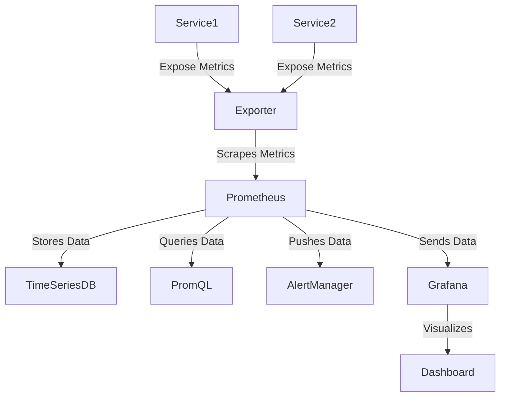

# 📊 Deep Research on Prometheus & Grafana with Spring Boot

Prometheus and Grafana are **powerful monitoring tools** for **observability, metrics collection, alerting, and visualization**. This guide covers **core concepts, setup, and integration with Spring Boot applications**.

📌 **Prometheus Docs**: [Prometheus Official Documentation](https://prometheus.io/docs/)  
📌 **Grafana Docs**: [Grafana Official Documentation](https://grafana.com/docs/)  
📌 **Spring Boot Micrometer**: [Spring Boot Actuator & Micrometer](https://docs.spring.io/spring-boot/docs/current/reference/html/actuator.html#actuator.metrics)  

---

## **1. What is Prometheus?**  

Prometheus is **an open-source monitoring system** designed for **collecting and storing time-series metrics**, with support for **powerful querying, alerting, and visualization**.

### **1.1 Key Features of Prometheus**  
✅ **Pull-based Monitoring** – Prometheus scrapes metrics from endpoints.  
✅ **Time-Series Data Storage** – Stores metrics efficiently for analysis.  
✅ **PromQL (Prometheus Query Language)** – Allows powerful querying.  
✅ **Alerting System** – Built-in alert manager for notifications.  
✅ **Service Discovery** – Auto-discovers services in Kubernetes and cloud.  

🔗 **More on Prometheus Concepts**: [Prometheus Overview](https://prometheus.io/docs/introduction/overview/)  

---

## **2. What is Grafana?**  

Grafana is a **real-time visualization tool** for monitoring metrics from Prometheus and other data sources.

### **2.1 Key Features of Grafana**  
✅ **Custom Dashboards** – Create dynamic visualizations.  
✅ **Multiple Data Sources** – Supports Prometheus, Elasticsearch, MySQL, etc.  
✅ **Alerting & Notifications** – Sends alerts via Slack, Email, PagerDuty, etc.  
✅ **Templating & Variables** – Dynamic dashboards for flexibility.  
✅ **Kubernetes & Cloud Monitoring** – Integrates with cloud platforms.  

🔗 **More on Grafana**: [Grafana Overview](https://grafana.com/docs/grafana/latest/getting-started/)  

---

## **3. Prometheus Architecture & Workflow**  

Prometheus follows a **pull-based monitoring approach**:



🔗 **More on Prometheus Architecture**: [Prometheus Design](https://prometheus.io/docs/introduction/overview/)  

---

## **4. Setting Up Prometheus & Grafana**  

### **4.1 Installing Prometheus (Docker Method)**  
```sh
docker run -p 9090:9090 prom/prometheus
```

### **4.2 Configuring Prometheus (`prometheus.yml`)**  
```yaml
global:
  scrape_interval: 15s

scrape_configs:
  - job_name: 'spring-boot-app'
    metrics_path: '/actuator/prometheus'
    static_configs:
      - targets: ['host.docker.internal:8080']
```

### **4.3 Installing Grafana (Docker Method)**  
```sh
docker run -d -p 3000:3000 grafana/grafana
```

### **4.4 Connecting Grafana to Prometheus**  
1. Open **Grafana UI** at [http://localhost:3000](http://localhost:3000).  
2. Go to **Configuration → Data Sources** → Add **Prometheus**.  
3. Set **URL** to `http://host.docker.internal:9090`.  
4. Save and Test the connection.  

🔗 **More on Grafana Setup**: [Grafana Data Sources](https://grafana.com/docs/grafana/latest/datasources/add-a-data-source/)  

---

## **5. Integrating Prometheus with Spring Boot**  

Spring Boot **exposes metrics** via the **Actuator** and **Micrometer**.

### **5.1 Adding Dependencies (`pom.xml`)**  
```xml
<dependency>
    <groupId>org.springframework.boot</groupId>
    <artifactId>spring-boot-starter-actuator</artifactId>
</dependency>
<dependency>
    <groupId>io.micrometer</groupId>
    <artifactId>micrometer-registry-prometheus</artifactId>
</dependency>
```

### **5.2 Enabling Prometheus Metrics (`application.yml`)**  
```yaml
management:
  endpoints:
    web:
      exposure:
        include: prometheus, metrics, health
  metrics:
    export:
      prometheus:
        enabled: true
```

### **5.3 Checking Metrics in Spring Boot**  
Start the application and check:  
[http://localhost:8080/actuator/prometheus](http://localhost:8080/actuator/prometheus)

🔗 **More on Spring Boot Actuator**: [Spring Boot Monitoring](https://docs.spring.io/spring-boot/docs/current/reference/html/actuator.html)  

---

## **6. Creating a Grafana Dashboard for Spring Boot Metrics**  

### **6.1 Import Pre-Built Grafana Dashboard**  
1. Open **Grafana UI**.  
2. Go to **Dashboards → Import**.  
3. Use **Dashboard ID: 4701 (Micrometer JVM Dashboard)**.  
4. Select **Prometheus as Data Source**.  
5. Click **Import** to visualize JVM metrics.  

🔗 **More on Grafana Dashboards**: [Grafana Dashboards](https://grafana.com/dashboards)  

---

## **7. Alerting with Prometheus & Grafana**  

### **7.1 Configuring Prometheus Alerts (`alert.rules.yml`)**  
```yaml
groups:
  - name: CPU Usage Alerts
    rules:
      - alert: HighCPUUsage
        expr: process_cpu_seconds_total > 2
        for: 1m
        labels:
          severity: warning
        annotations:
          summary: "High CPU usage detected"
```

### **7.2 Configuring Grafana Alerts**  
1. Open **Grafana UI** → **Alerts**.  
2. Create **New Alert Rule**.  
3. Select **Prometheus as Data Source**.  
4. Set **Threshold Condition (e.g., CPU Usage > 80%)**.  
5. Configure **Notification Channels** (Email, Slack, PagerDuty).  

🔗 **More on Alerts**: [Prometheus Alerting](https://prometheus.io/docs/alerting/latest/overview/)  

---

## **8. Debugging & Optimizing Prometheus/Grafana**  

### **8.1 Debugging Prometheus Issues**  
```sh
# Check Prometheus logs
docker logs prom-container

# Verify if Prometheus is scraping targets
curl http://localhost:9090/api/v1/targets
```

### **8.2 Optimizing Prometheus Performance**  
- **Increase Retention Period**:  
  ```yaml
  storage.tsdb.retention.time: 30d
  ```
- **Use Recording Rules** to precompute metrics.  
- **Downsample Data** for long-term storage.  

🔗 **Prometheus Performance Tips**: [Prometheus Optimization](https://prometheus.io/docs/practices/)  

---

### **Final Thoughts**  
Prometheus & Grafana **enable scalable monitoring & alerting** for **Spring Boot applications**. By leveraging **Micrometer, Actuator, and PromQL**, teams can **gain deep observability into JVM, database, and API metrics**.

### **Happy Monitoring with Prometheus & Grafana! 📊🚀**  
