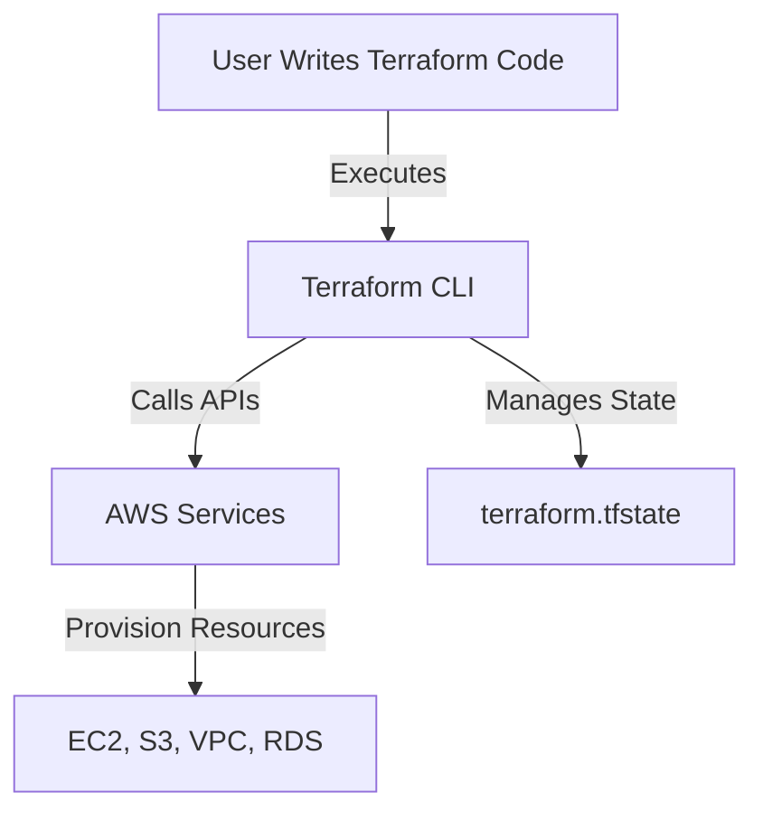

# 🌍 Deep Research & Getting Started with Terraform & AWS

Terraform is **an Infrastructure as Code (IaC) tool** that enables **automated provisioning and management of AWS infrastructure** using declarative configuration files.

📌 **Official Terraform Documentation**: [Terraform Docs](https://developer.hashicorp.com/terraform/docs)  
📌 **Terraform AWS Provider**: [AWS Provider Docs](https://registry.terraform.io/providers/hashicorp/aws/latest/docs)  
📌 **Terraform GitHub**: [Terraform GitHub](https://github.com/hashicorp/terraform)  

---

## **1. What is Terraform?**  

Terraform is an **open-source IaC tool** that **automates cloud infrastructure deployment** using configuration files.

### **1.1 Key Features of Terraform**  
✅ **Declarative Infrastructure** – Define desired state using code.  
✅ **Multi-Cloud Support** – Works with AWS, Azure, GCP, and more.  
✅ **Immutable Infrastructure** – Replaces resources instead of modifying them.  
✅ **State Management** – Tracks infrastructure changes using a state file.  
✅ **Dependency Management** – Handles resource dependencies automatically.  

🔗 **More on Terraform Concepts**: [Terraform Overview](https://developer.hashicorp.com/terraform/docs/intro)  

---

## **2. How Terraform Works**  



| Step | Description |
|------|------------|
| **Write Code** | Define resources using `.tf` files. |
| **Initialize** | Run `terraform init` to install providers. |
| **Plan** | Preview changes before applying (`terraform plan`). |
| **Apply** | Deploy infrastructure (`terraform apply`). |
| **Destroy** | Remove resources (`terraform destroy`). |

🔗 **More on Terraform Workflow**: [Terraform CLI Commands](https://developer.hashicorp.com/terraform/docs/cli)  

---

## **3. Installing & Setting Up Terraform for AWS**  

### **3.1 Install Terraform (CLI Method)**  
```sh
# MacOS (Homebrew)
brew install terraform

# Linux
sudo apt-get install terraform

# Windows (Chocolatey)
choco install terraform
```

### **3.2 Verify Installation**  
```sh
terraform --version
```

### **3.3 Configure AWS CLI (Required for Terraform AWS)**  
```sh
aws configure
```

🔗 **More on Terraform Installation**: [Terraform Install Guide](https://developer.hashicorp.com/terraform/docs/install)  

---

## **4. Writing Your First Terraform Script for AWS**  

### **4.1 Create a Terraform Configuration (`main.tf`)**  
```hcl
provider "aws" {
  region = "us-east-1"
}

resource "aws_instance" "example" {
  ami           = "ami-0c55b159cbfafe1f0"
  instance_type = "t2.micro"

  tags = {
    Name = "TerraformExampleInstance"
  }
}
```

### **4.2 Initialize Terraform**  
```sh
terraform init
```

### **4.3 Plan & Apply Changes**  
```sh
terraform plan
terraform apply
```

### **4.4 Destroy Resources**  
```sh
terraform destroy
```

🔗 **More on AWS Provider**: [Terraform AWS Provider](https://registry.terraform.io/providers/hashicorp/aws/latest/docs)  

---

## **5. Managing Terraform State**  

### **5.1 State File (`terraform.tfstate`)**  
Terraform keeps track of the deployed infrastructure using a **state file**.

### **5.2 Store Terraform State Remotely (S3 Backend)**  
```hcl
terraform {
  backend "s3" {
    bucket = "my-terraform-state"
    key    = "terraform.tfstate"
    region = "us-east-1"
  }
}
```

🔗 **More on Terraform State**: [State Management](https://developer.hashicorp.com/terraform/docs/state)  

---

## **6. Using Terraform Modules for Reusability**  

### **6.1 Create a Reusable EC2 Module (`modules/ec2/main.tf`)**  
```hcl
variable "instance_type" {}

resource "aws_instance" "example" {
  ami           = "ami-0c55b159cbfafe1f0"
  instance_type = var.instance_type
}
```

### **6.2 Use the Module in a Main Terraform File**  
```hcl
module "ec2_instance" {
  source        = "./modules/ec2"
  instance_type = "t3.micro"
}
```

🔗 **More on Terraform Modules**: [Terraform Modules](https://developer.hashicorp.com/terraform/docs/modules)  

---

## **7. Automating Terraform with CI/CD (GitHub Actions)**  

### **7.1 Terraform GitHub Actions Workflow (`.github/workflows/terraform.yml`)**  
```yaml
name: Terraform AWS Deployment

on:
  push:
    branches:
      - main

jobs:
  terraform:
    runs-on: ubuntu-latest

    steps:
      - name: Checkout Repository
        uses: actions/checkout@v3

      - name: Install Terraform
        uses: hashicorp/setup-terraform@v2

      - name: Initialize Terraform
        run: terraform init

      - name: Plan Terraform Changes
        run: terraform plan

      - name: Apply Terraform Changes
        run: terraform apply -auto-approve
```

🔗 **More on Terraform CI/CD**: [Terraform in CI/CD](https://developer.hashicorp.com/terraform/docs/cloud/cicd)  

---

## **8. Debugging & Best Practices in Terraform**  

### **8.1 Debugging Terraform Errors**  
```sh
terraform validate  # Validate configuration
terraform fmt       # Format code
terraform show      # Inspect current state
```

### **8.2 Best Practices for Terraform on AWS**  
| Best Practice | Why It Matters |
|--------------|---------------|
| **Use Remote State** | Ensures team collaboration. |
| **Implement IAM Roles** | Enhances security for AWS access. |
| **Use Modules** | Encourages code reusability. |
| **Lock State File** | Prevents state corruption in teams. |
| **Use Terraform Cloud** | Enables team collaboration & versioning. |

🔗 **More on Terraform Debugging**: [Terraform Debugging](https://developer.hashicorp.com/terraform/docs/debugging)  

---

### **Final Thoughts**  
Terraform provides **a powerful way to automate AWS infrastructure** by using **declarative configuration files and state management**. By **leveraging best practices and automation**, teams can **manage cloud environments efficiently**.

### **Happy Automating with Terraform & AWS! 🌍🚀**  
