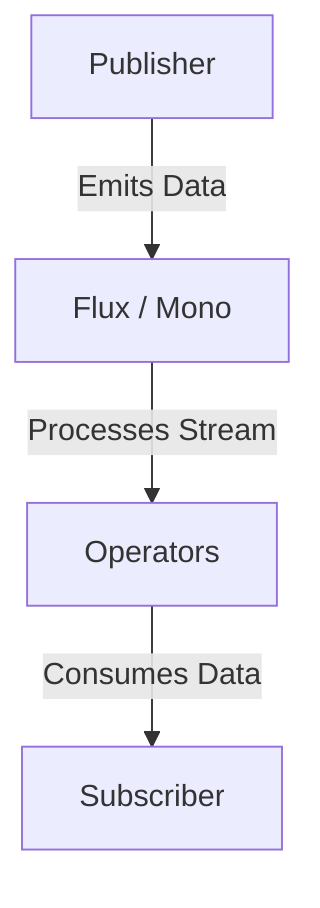

# ⚡ Deep Research & Getting Started with Reactor Framework

Project Reactor is **a reactive programming library for Java**, built to handle **asynchronous data streams** efficiently.

📌 **Reactor Official Documentation**: [Reactor Docs](https://projectreactor.io/docs/core/release/reference/)  
📌 **Spring WebFlux & Reactor**: [Spring WebFlux Docs](https://docs.spring.io/spring-framework/docs/current/reference/html/web-reactive.html)  
📌 **Reactive Streams Specification**: [Reactive Streams](https://www.reactive-streams.org/)  

---

## **1. What is Reactor?**  

Reactor is **a fully non-blocking, reactive programming library** based on **Reactive Streams**. It provides **Flux and Mono** types for handling **asynchronous data**.

### **1.1 Key Features of Reactor**  
✅ **Reactive Streams Compliance** – Works with `Publisher`, `Subscriber`, `Processor`.  
✅ **Backpressure Handling** – Prevents overwhelming consumers with too much data.  
✅ **Functional API** – Supports declarative composition of streams.  
✅ **High Performance** – Efficiently processes large data streams.  
✅ **Seamless Spring WebFlux Integration** – Works with Spring Boot & WebFlux.  

🔗 **More on Reactor Concepts**: [Reactor Overview](https://projectreactor.io/docs/core/release/reference/)  

---

## **2. Reactor Core Components**  



| Component | Description |
|-----------|------------|
| **Publisher** | Produces data asynchronously (e.g., `Flux`, `Mono`). |
| **Flux** | Represents multiple values over time. |
| **Mono** | Represents a single value or empty result. |
| **Operators** | Transforms or filters data streams. |
| **Subscriber** | Consumes and reacts to emitted data. |

🔗 **More on Reactor Streams**: [Reactor Streams](https://projectreactor.io/docs/core/release/reference/#reactive.streams.spec)  

---

## **3. Getting Started with Reactor**  

### **3.1 Adding Reactor to a Java Project (`pom.xml`)**  
```xml
<dependency>
    <groupId>io.projectreactor</groupId>
    <artifactId>reactor-core</artifactId>
    <version>3.5.0</version>
</dependency>
```

### **3.2 Creating a Simple Reactive Stream**  
```java
import reactor.core.publisher.Flux;

public class HelloWorldReactor {
    public static void main(String[] args) {
        Flux.just("Hello", "Reactive", "World!")
            .map(String::toUpperCase)
            .subscribe(System.out::println);
    }
}
```

🔗 **More on Flux & Mono**: [Flux & Mono API](https://projectreactor.io/docs/core/release/reference/#core-features)  

---

## **4. Understanding Flux and Mono**  

### **4.1 Using `Mono` for Single Value**  
```java
import reactor.core.publisher.Mono;

Mono<String> mono = Mono.just("Hello Reactor");
mono.subscribe(System.out::println);
```

### **4.2 Using `Flux` for Multiple Values**  
```java
Flux<String> flux = Flux.just("Apple", "Banana", "Cherry");
flux.subscribe(System.out::println);
```

### **4.3 Transforming Data with `map()`**  
```java
Flux<String> transformedFlux = Flux.just("java", "reactor")
    .map(String::toUpperCase);
transformedFlux.subscribe(System.out::println);
```

🔗 **More on Transformations**: [Reactor Operators](https://projectreactor.io/docs/core/release/reference/#which-operator)  

---

## **5. Handling Errors in Reactor**  

### **5.1 Handling Errors with `onErrorReturn()`**  
```java
Flux<Integer> flux = Flux.just(1, 2, 3, 0)
    .map(i -> 10 / i)
    .onErrorReturn(-1);

flux.subscribe(System.out::println);
```

### **5.2 Using `onErrorResume()` to Provide a Fallback**  
```java
Flux<Integer> flux = Flux.just(1, 2, 3, 0)
    .map(i -> 10 / i)
    .onErrorResume(e -> Flux.just(100, 200));

flux.subscribe(System.out::println);
```

🔗 **More on Error Handling**: [Reactor Error Handling](https://projectreactor.io/docs/core/release/reference/#error.handling)  

---

## **6. Combining Multiple Streams**  

### **6.1 Merging Two Streams (`mergeWith`)**  
```java
Flux<String> flux1 = Flux.just("Hello", "World");
Flux<String> flux2 = Flux.just("Reactor", "Flux");
Flux<String> merged = flux1.mergeWith(flux2);

merged.subscribe(System.out::println);
```

### **6.2 Zipping Streams (`zip`)**  
```java
Flux<String> flux1 = Flux.just("A", "B", "C");
Flux<Integer> flux2 = Flux.just(1, 2, 3);

Flux<String> zipped = Flux.zip(flux1, flux2, (a, b) -> a + b);
zipped.subscribe(System.out::println);
```

🔗 **More on Stream Combinations**: [Reactor Combining](https://projectreactor.io/docs/core/release/reference/#which-operator)  

---

## **7. Using Reactor in Spring Boot WebFlux**  

### **7.1 Add WebFlux Dependency (`pom.xml`)**  
```xml
<dependency>
    <groupId>org.springframework.boot</groupId>
    <artifactId>spring-boot-starter-webflux</artifactId>
</dependency>
```

### **7.2 Create a Reactive REST Controller**  
```java
import org.springframework.web.bind.annotation.*;
import reactor.core.publisher.Flux;
import reactor.core.publisher.Mono;

@RestController
@RequestMapping("/api")
public class ReactiveController {

    @GetMapping("/mono")
    public Mono<String> getMono() {
        return Mono.just("Hello from Mono!");
    }

    @GetMapping("/flux")
    public Flux<String> getFlux() {
        return Flux.just("Hello", "from", "Flux!");
    }
}
```

🔗 **More on Spring WebFlux**: [Spring WebFlux Guide](https://docs.spring.io/spring-framework/docs/current/reference/html/web-reactive.html)  

---

## **8. Debugging & Best Practices in Reactor**  

### **8.1 Debugging with `log()`**  
```java
Flux<String> flux = Flux.just("A", "B", "C")
    .log();

flux.subscribe(System.out::println);
```

### **8.2 Best Practices for Reactor in Java**  
| Best Practice | Why It Matters |
|--------------|---------------|
| **Use Non-Blocking APIs** | Prevents thread starvation in reactive applications. |
| **Handle Backpressure** | Prevents resource exhaustion. |
| **Use `.log()` for Debugging** | Helps trace issues in streams. |
| **Avoid Blocking Calls** | Blocking methods break reactive chains. |
| **Use `Schedulers.parallel()` for CPU-bound Work** | Improves performance on multicore CPUs. |

🔗 **More on Debugging**: [Reactor Debugging](https://projectreactor.io/docs/core/release/reference/#debugging)  

---

### **Final Thoughts**  
Reactor provides **powerful, flexible, and high-performance** reactive programming capabilities. By mastering **Flux, Mono, error handling, and Spring WebFlux**, developers can **build scalable, non-blocking applications**.

### **Happy Reactive Programming with Reactor! ⚡🚀**  
