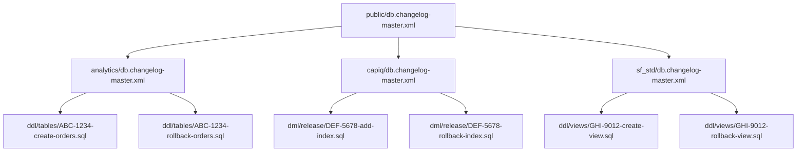
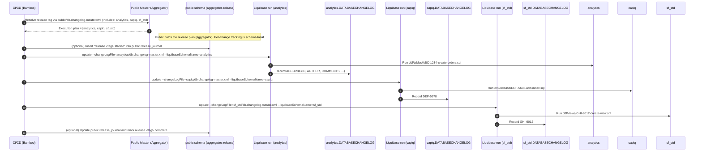

# Contributing Guide — Liquibase (SQL‑First, Multi‑Schema)

This repository standardizes **Liquibase with SQL files** per schema. A single **master changelog in `public`** aggregates schema‑specific masters for a given release. Each schema maintains its **own** `DATABASECHANGELOG` and `DATABASECHANGELOGLOCK` tables by running Liquibase **once per schema** in CI/CD.

---

## Overview

- **SQL‑first:** every changeset links to a `.sql` file; _no inline SQL_ in the XML.
- **Per‑schema tracking:** each schema writes to **its own** changelog tables.
- **Public = release aggregator:** `public/db.changelog-master.xml` lists which schema masters are part of the release plan.
- **Schema targeting:** because we use raw SQL, set the session schema (e.g., Postgres: `SET search_path TO <schema>;`) or fully‑qualify object names.
- **Traceable:** each changeset maps to a Jira ticket (ID), with helpful `<comment>` text for context and auditability.

---

## Directory Structure

```
<datastore>/
  public/
    db.changelog-master.xml
  <schema>/
    db.changelog-master.xml
    ddl/
      function/
      tables/
      views/
    dml/
      release/
```

> Keep forward & rollback SQL **next to** the object they affect (e.g., both under `ddl/tables/` or both under `dml/release/`).

---

## How the changelogs link



---

## Sequence of execution (per‑schema tracking, public as aggregator)



> **Why separate runs per schema?** Running one Liquibase execution per schema (each with `--liquibaseSchemaName=<schema>`) ensures that each schema maintains its **own** changelog tables and can evolve independently, while `public` serves only as the **release aggregator**.

---

## Authoring Rules (must‑follow)

- **Linked SQL only:** all changesets must link to `.sql` files via `<sqlFile .../>`. _No SQL directly inside the `<changeSet>`._
- **Changeset ID format:** `id="<JIRA [commit]>"`
  - Required prefix = Jira key (e.g., `ABC-1234`)
  - Optional suffix = short commit hash (e.g., `ABC-1234-1a2b3c`)
- **Use `<comment>`:** add a concise purpose, Jira URL, owner, risk/dependencies where helpful.
- **Rollback required:** every changeset must include a rollback SQL file.
- **Schema targeting:** add `SET search_path TO <schema>;` (Postgres) at the top of each changeset or fully‑qualify object names.
- **Immutability:** never modify released SQL; add a new changeset for further changes.

---

## Templates

### A) `public/db.changelog-master.xml` (aggregator only)
```xml
<databaseChangeLog xmlns="http://www.liquibase.org/xml/ns/dbchangelog"
  xmlns:xsi="http://www.w3.org/2001/XMLSchema-instance"
  xsi:schemaLocation="http://www.liquibase.org/xml/ns/dbchangelog
                      http://www.liquibase.org/xml/ns/dbchangelog/dbchangelog-4.15.xsd">

  <!-- Order = execution plan for the release -->
  <include file="../analytics/db.changelog-master.xml" relativeToChangelogFile="true" context="analytics"/>
  <include file="../capiq/db.changelog-master.xml" relativeToChangelogFile="true" context="capiq"/>
  <include file="../sf_std/db.changelog-master.xml" relativeToChangelogFile="true" context="sf_std"/>
</databaseChangeLog>
```

### B) `<schema>/db.changelog-master.xml` (schema‑local master)
```xml
<databaseChangeLog xmlns="http://www.liquibase.org/xml/ns/dbchangelog"
  xmlns:xsi="http://www.w3.org/2001/XMLSchema-instance"
  xsi:schemaLocation="http://www.liquibase.org/xml/ns/dbchangelog
                      http://www.liquibase.org/xml/ns/dbchangelog/dbchangelog-4.15.xsd">

  <changeSet id="ABC-1234" author="jdoe" labels="tables,orders" context="prod,staging">
    <comment>
      Create orders table; FK to customer. JIRA: ABC-1234
    </comment>

    <!-- Ensure SQL runs in this schema (Postgres example) -->
    <sql>SET search_path TO analytics;</sql>

    <sqlFile path="ddl/tables/ABC-1234-create-orders.sql" relativeToChangelogFile="true"/>
    <rollback>
      <sqlFile path="ddl/tables/ABC-1234-rollback-orders.sql" relativeToChangelogFile="true"/>
    </rollback>
  </changeSet>
</databaseChangeLog>
```

### C) Forward SQL example — `ddl/tables/ABC-1234-create-orders.sql`
```sql
SET search_path TO analytics;

CREATE TABLE IF NOT EXISTS orders (
  id BIGSERIAL PRIMARY KEY,
  customer_id BIGINT NOT NULL,
  order_date TIMESTAMP NOT NULL,
  status VARCHAR(50) NOT NULL
);

ALTER TABLE analytics.orders
  ADD CONSTRAINT fk_orders_customer
  FOREIGN KEY (customer_id) REFERENCES analytics.customer(id);
```

### D) Rollback SQL example — `ddl/tables/ABC-1234-rollback-orders.sql`
```sql
SET search_path TO analytics;
DROP TABLE IF EXISTS orders;
```

---

## CI/CD Invocation (example)

Run **one update per schema** so each tracks in its own changelog tables; use the public master only to define the plan / aggregate the release.

```bash
# Optional: preview across all included schemas
liquibase --changeLogFile=public/db.changelog-master.xml --contexts=analytics,capiq,sf_std status

# Execute per-schema
liquibase --changeLogFile=analytics/db.changelog-master.xml --liquibaseSchemaName=analytics update
liquibase --changeLogFile=capiq/db.changelog-master.xml     --liquibaseSchemaName=capiq     update
liquibase --changeLogFile=sf_std/db.changelog-master.xml    --liquibaseSchemaName=sf_std    update
```

_Optionally_ record the release lifecycle in `public.release_journal` before/after these runs.

---

## PR Review Checklist

- [ ] Changeset ID = `JIRA[ optional-commit ]` (e.g., `ABC-1234` or `ABC-1234-1a2b3c`)
- [ ] Uses `<sqlFile>` (no inline SQL)
- [ ] `<comment>` is present and meaningful (link to Jira, purpose, owner)
- [ ] Includes rollback SQL
- [ ] SQL targets the correct schema (session schema set or FQNs)
- [ ] No edits to previously released SQL; new changeset created if needed
- [ ] Pre-conditions (where appropriate) for destructive or dependent changes
