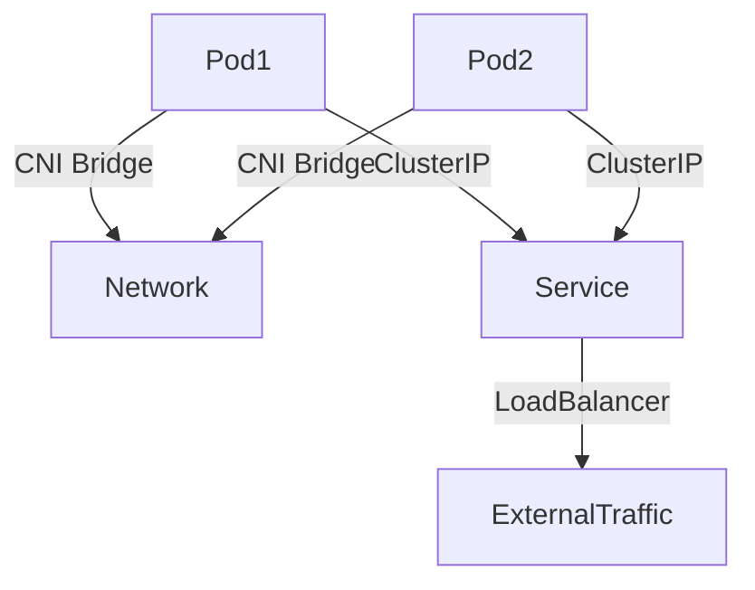

# 🌐 Deep Dive into Networking: Unix, Kubernetes & Docker

Networking is a **critical component** of modern computing, enabling **communication between systems, containers, and Kubernetes clusters**. This guide covers **networking concepts in Unix/Linux, Kubernetes, and Docker**, along with **troubleshooting techniques and debugging commands**.

📌 **Linux Networking Basics**: [Linux Networking Guide](https://linux.die.net/man/7/netdevice)  
📌 **Kubernetes Networking**: [Kubernetes Networking Docs](https://kubernetes.io/docs/concepts/cluster-administration/networking/)  
📌 **Docker Networking**: [Docker Networking Overview](https://docs.docker.com/network/)  

---

## **1. Unix/Linux Networking Basics**

Networking in Unix/Linux is **based on the TCP/IP stack**, with tools for **interface configuration, routing, packet analysis, and debugging**.

### **1.1 Network Interface Configuration**  
- **View network interfaces**  
  ```sh
  ip addr show
  ```
- **Bring an interface up/down**  
  ```sh
  ip link set eth0 up
  ip link set eth0 down
  ```

### **1.2 Network Routing & Connectivity**  
- **Show routing table**  
  ```sh
  ip route show
  ```
- **Test connectivity with ping**  
  ```sh
  ping -c 4 google.com
  ```
- **Trace network path**  
  ```sh
  traceroute google.com
  ```

🔗 **Linux Networking Basics**: [Linux Networking Documentation](https://linux.die.net/man/7/netdevice)  

---

## **2. Kubernetes Networking**

Kubernetes **relies on CNI (Container Network Interface)** plugins to provide **pod-to-pod, service, and ingress networking**.

### **2.1 Kubernetes Network Model**  


### **2.2 Debugging Kubernetes Networking**  
- **List all network policies**  
  ```sh
  kubectl get networkpolicy --all-namespaces
  ```
- **Check pod network connectivity**  
  ```sh
  kubectl exec -it pod-name -- ping 10.244.1.2
  ```
- **Test Kubernetes DNS resolution**  
  ```sh
  kubectl exec -it pod-name -- nslookup service-name
  ```

🔗 **Kubernetes Networking Docs**: [Kubernetes Networking](https://kubernetes.io/docs/concepts/cluster-administration/networking/)  

---

## **3. Docker Networking**

Docker provides **networking drivers** to enable container communication:

| Network Type  | Description |
|--------------|------------|
| **bridge**   | Default network for standalone containers |
| **host**     | Shares host's network stack (no isolation) |
| **overlay**  | Multi-host networking for Swarm |
| **macvlan**  | Assigns real MAC addresses to containers |

### **3.1 Viewing & Managing Docker Networks**  
- **List networks**  
  ```sh
  docker network ls
  ```
- **Inspect network details**  
  ```sh
  docker network inspect bridge
  ```
- **Create a custom network**  
  ```sh
  docker network create my_network
  ```

### **3.2 Connecting Containers to Networks**  
- **Run container in a specific network**  
  ```sh
  docker run --network=my_network alpine ping google.com
  ```
- **Attach an existing container to a network**  
  ```sh
  docker network connect my_network my_container
  ```

🔗 **Docker Networking Guide**: [Docker Network Docs](https://docs.docker.com/network/)  

---

## **4. Debugging & Troubleshooting Networking Issues**

### **4.1 Common Unix Networking Commands**  
| Command | Description |
|---------|------------|
| `ifconfig` / `ip addr` | Show network interfaces |
| `netstat -tulnp` | Show open ports & listening services |
| `ss -tulnp` | Alternative to netstat for showing network connections |
| `tcpdump -i eth0` | Capture network packets |
| `iptables -L -v -n` | Show firewall rules |
| `dig google.com` | Query DNS records |
| `nslookup google.com` | DNS resolution test |

### **4.2 Kubernetes Network Debugging**  
| Command | Description |
|---------|------------|
| `kubectl get pods -o wide` | Show pod IP addresses |
| `kubectl exec -it pod-name -- curl http://service-name` | Test internal service connectivity |
| `kubectl logs pod-name` | Check logs for networking errors |
| `kubectl describe svc service-name` | Get details about a service |

### **4.3 Docker Network Debugging**  
| Command | Description |
|---------|------------|
| `docker network inspect bridge` | Show details about a network |
| `docker exec -it container-name ping another-container` | Test container connectivity |
| `docker logs container-name` | Check logs for networking issues |
| `docker run --rm busybox nslookup google.com` | Test DNS resolution inside a container |

🔗 **Networking Debugging Tools**: [Linux Troubleshooting Guide](https://linuxhint.com/network-troubleshooting-linux/)  

---

### **Final Thoughts**  
Networking is **essential for system administration, containerized environments, and Kubernetes deployments**. By understanding **networking concepts, debugging techniques, and key commands**, you can **diagnose and resolve networking issues efficiently**.

### **Happy Troubleshooting! 🌐🚀**  
