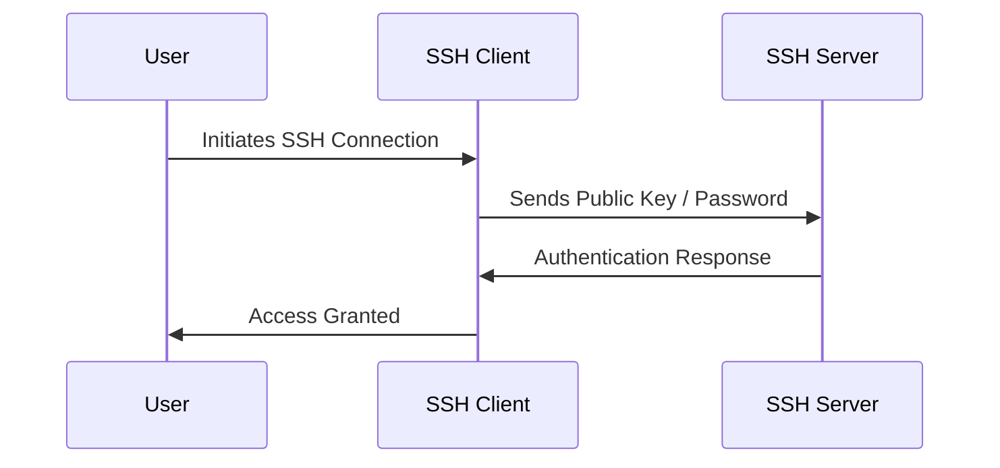

# 🔐 Deep Research & User Guide for SSH (Secure Shell)

SSH (Secure Shell) is **a cryptographic network protocol** used for **secure communication, remote login, and command execution** over an insecure network.

📌 **Official OpenSSH Documentation**: [OpenSSH Docs](https://www.openssh.com/manual.html)  
📌 **SSH Config Guide**: [SSH Config Docs](https://man.openbsd.org/ssh_config)  
📌 **GitHub SSH Guide**: [GitHub SSH Docs](https://docs.github.com/en/authentication/connecting-to-github-with-ssh)  

---

## **1. What is SSH?**  

SSH is **a protocol for securely accessing remote systems** and encrypting network communication.

### **1.1 Key Features of SSH**  
✅ **Secure Remote Access** – Encrypts connections to remote systems.  
✅ **Key-Based Authentication** – Uses public-private key pairs for authentication.  
✅ **Tunneling & Port Forwarding** – Encrypts traffic for secure access to services.  
✅ **File Transfers** – Securely copies files with `scp` or `sftp`.  
✅ **Multiplexing & Proxying** – Supports multiple connections over a single session.  

🔗 **More on SSH Concepts**: [SSH Overview](https://www.openssh.com/manual.html)  

---

## **2. How SSH Works**  



| Component | Description |
|-----------|------------|
| **SSH Client** | The software used to initiate an SSH connection. |
| **SSH Server** | The system that accepts SSH connections. |
| **Public Key** | Used to authenticate users without passwords. |
| **Private Key** | Kept securely on the client for authentication. |

🔗 **More on SSH Protocol**: [SSH Architecture](https://www.ssh.com/academy/ssh/protocol)  

---

## **3. Installing & Setting Up SSH**  

### **3.1 Installing SSH (OpenSSH)**  

#### **Linux/macOS**  
```sh
sudo apt install openssh-client  # Debian-based
sudo yum install openssh-clients # RHEL-based
```

#### **Windows (Using OpenSSH)**  
```powershell
Get-WindowsFeature -Name OpenSSH*
```

### **3.2 Verify SSH Installation**  
```sh
ssh -V
```

🔗 **More on OpenSSH Installation**: [OpenSSH Install Guide](https://www.openssh.com/)  

---

## **4. Connecting to a Remote Server Using SSH**  

### **4.1 Basic SSH Command**  
```sh
ssh username@remote_host
```

### **4.2 Connecting with a Specific Port**  
```sh
ssh -p 2222 username@remote_host
```

### **4.3 Using Key-Based Authentication**  
```sh
ssh -i ~/.ssh/my_key.pem username@remote_host
```

🔗 **More on SSH Connections**: [SSH Connection Guide](https://man.openbsd.org/ssh)  

---

## **5. Generating and Using SSH Keys**  

### **5.1 Generate an SSH Key Pair**  
```sh
ssh-keygen -t rsa -b 4096 -f ~/.ssh/my_key
```

### **5.2 Copy Public Key to a Server**  
```sh
ssh-copy-id username@remote_host
```

### **5.3 Manually Adding a Public Key to `~/.ssh/authorized_keys`**  
```sh
cat ~/.ssh/my_key.pub >> ~/.ssh/authorized_keys
```

🔗 **More on SSH Keys**: [SSH Key Authentication](https://www.ssh.com/academy/ssh/key)  

---

## **6. Configuring SSH for Easier Use**  

### **6.1 Using an SSH Config File (`~/.ssh/config`)**  
```sh
Host myserver
    HostName remote_host
    User username
    IdentityFile ~/.ssh/my_key
    Port 22
```

### **6.2 Connecting Using Shortened Command**  
```sh
ssh myserver
```

🔗 **More on SSH Config Files**: [SSH Config Guide](https://man.openbsd.org/ssh_config)  

---

## **7. Secure File Transfers Using SSH**  

### **7.1 Copying Files with `scp` (Secure Copy Protocol)**  
```sh
scp file.txt username@remote_host:/home/username/
```

### **7.2 Using `sftp` for Interactive File Transfers**  
```sh
sftp username@remote_host
put local_file.txt  # Upload file
get remote_file.txt  # Download file
exit  # Close session
```

🔗 **More on SCP & SFTP**: [SCP & SFTP Docs](https://linux.die.net/man/1/scp)  

---

## **8. Tunneling & Port Forwarding with SSH**  

### **8.1 Local Port Forwarding** (Access remote service locally)  
```sh
ssh -L 8080:localhost:80 username@remote_host
```

### **8.2 Remote Port Forwarding** (Expose local service remotely)  
```sh
ssh -R 9090:localhost:3000 username@remote_host
```

🔗 **More on SSH Port Forwarding**: [SSH Tunneling Guide](https://www.ssh.com/academy/ssh/tunneling)  

---

## **9. Debugging & Best Practices in SSH**  

### **9.1 Debugging SSH Connections**  
```sh
ssh -v username@remote_host  # Show verbose output
```

### **9.2 Best Practices for Secure SSH Usage**  
| Best Practice | Why It Matters |
|--------------|---------------|
| **Disable Root Login** | Prevents direct root access via SSH. |
| **Use Key Authentication** | Stronger security than passwords. |
| **Restrict SSH Access** | Use `AllowUsers` in `sshd_config`. |
| **Change Default SSH Port** | Reduces brute-force attacks. |
| **Enable Two-Factor Authentication** | Adds extra security for SSH access. |

🔗 **More on SSH Hardening**: [SSH Security Best Practices](https://www.ssh.com/academy/ssh/security)  

---

### **Final Thoughts**  
SSH is a **critical tool for secure remote access, file transfers, and tunneling**. By following **best practices and security measures**, users can **ensure safe and efficient management of remote systems**.

### **Happy Secure Shelling with SSH! 🔐🚀**  
